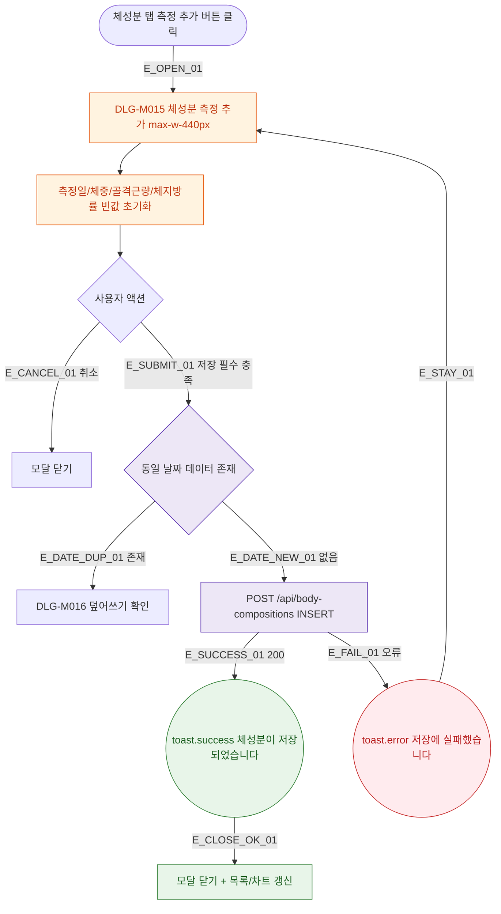

## 1. 목적

DLG-M015 체성분 측정 추가 다이얼로그의 열기/닫기/완료 생명주기를 명세한다.

## 2. 트리거/전제조건

- 체성분 탭 > "측정 추가" 버튼 클릭

## 3. 다이어그램

## 4. 엣지 설명

| 엣지 ID | 출발 | 도착 | 조건 |
|---------|------|------|------|
| E_OPEN_01 | 측정 추가 | 모달 열기 | - |
| E_SUBMIT_01 | 저장 | 날짜 중복 확인 | 필수 충족 |
| E_DATE_DUP_01 | 날짜 확인 | 덮어쓰기 모달 | 중복 존재 |
| E_DATE_NEW_01 | 날짜 확인 | INSERT API | 새 데이터 |
| E_SUCCESS_01 | API | toast.success | 200 |
| E_FAIL_01 | API | toast.error | 오류 |

## 5. TC 후보

| TC ID | 타입 | Given | When | Then |
|-------|------|-------|------|------|
| TC-DLG-M015-M1-01 | positive | 새 날짜 + 필수 입력 | 저장 200 | toast.success + 갱신 |
| TC-DLG-M015-M1-02 | positive | 중복 날짜 | 저장 | DLG-M016 열림 |
| TC-DLG-M015-M1-03 | exception | API 오류 | 저장 | toast.error + 모달 유지 |
| TC-DLG-M015-M1-04 | positive | 모달 열림 | 취소 | 모달 닫힘 |
