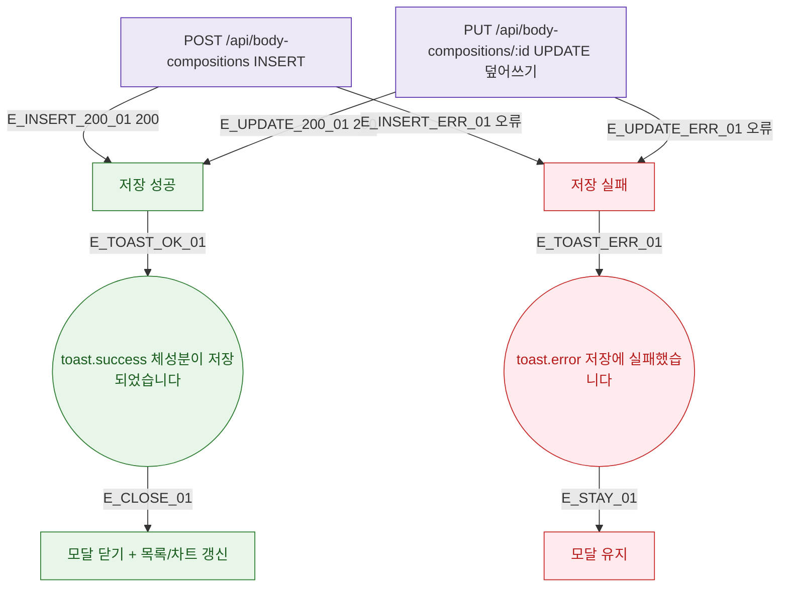

## 1. 목적

DLG-M015 체성분 저장 API 응답별 결과 분기를 명세한다.

## 2. 트리거/전제조건

- POST /api/body-compositions 호출 후 (또는 DLG-M016 덮어쓰기 확인 후 PUT)

## 3. 다이어그램

## 4. 엣지 설명

| 엣지 ID | 출발 | 도착 | 조건 |
|---------|------|------|------|
| E_INSERT_200_01 | INSERT API | 성공 | 200 |
| E_UPDATE_200_01 | UPDATE API | 성공 | 200 (덮어쓰기) |
| E_INSERT_ERR_01 | INSERT API | 실패 | 오류 |
| E_TOAST_OK_01 | 성공 | toast.success | - |
| E_TOAST_ERR_01 | 실패 | toast.error | - |

## 5. TC 후보

| TC ID | 타입 | Given | When | Then |
|-------|------|-------|------|------|
| TC-DLG-M015-M3-01 | positive | INSERT 200 | 저장 | toast.success + 닫힘 + 갱신 |
| TC-DLG-M015-M3-02 | positive | 덮어쓰기 200 | 저장 | toast.success + 닫힘 + 갱신 |
| TC-DLG-M015-M3-03 | exception | API 오류 | 저장 | toast.error + 모달 유지 |
