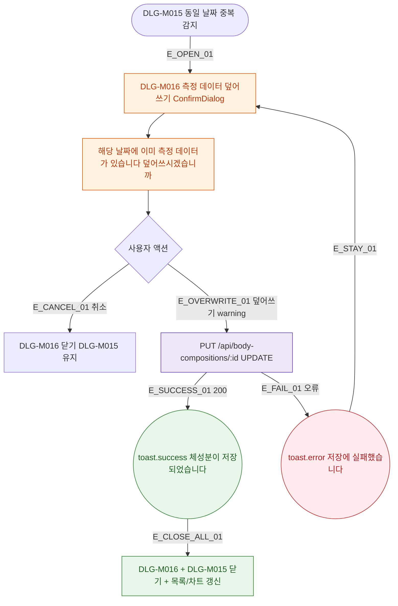

## 1. 목적

DLG-M016 체성분 덮어쓰기 확인 다이얼로그의 열기/닫기/완료 생명주기를 명세한다.

## 2. 트리거/전제조건

- DLG-M015 저장 시 동일 날짜에 이미 데이터 존재하는 경우

## 3. 다이어그램

## 4. 엣지 설명

| 엣지 ID | 출발 | 도착 | 조건 |
|---------|------|------|------|
| E_OPEN_01 | 중복 감지 | 모달 열기 | 동일 날짜 존재 |
| E_CANCEL_01 | 취소 | DLG-M016만 닫기 | - |
| E_OVERWRITE_01 | 덮어쓰기 | PUT API | warning 버튼 클릭 |
| E_SUCCESS_01 | API | toast.success | 200 |
| E_FAIL_01 | API | toast.error | 오류 |

## 5. TC 후보

| TC ID | 타입 | Given | When | Then |
|-------|------|-------|------|------|
| TC-DLG-M016-M1-01 | positive | 중복 날짜 | DLG-M015 저장 | DLG-M016 열림 |
| TC-DLG-M016-M1-02 | positive | API 200 | 덮어쓰기 | toast.success + 두 모달 닫힘 + 갱신 |
| TC-DLG-M016-M1-03 | exception | API 오류 | 덮어쓰기 | toast.error + 모달 유지 |
| TC-DLG-M016-M1-04 | positive | 모달 열림 | 취소 | DLG-M016만 닫힘, DLG-M015 유지 |
