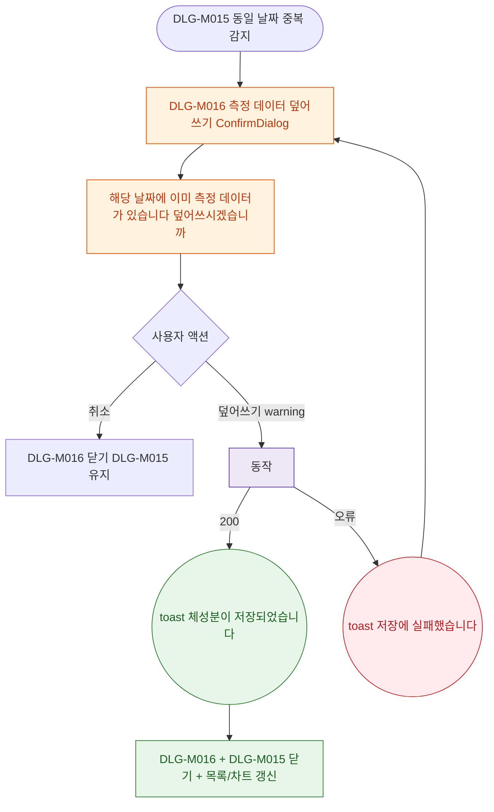

## 1. 목적

DLG-M016 체성분 덮어쓰기 확인 다이얼로그의 열기/닫기/완료 생명주기를 명세한다.

## 2. 트리거/전제조건

- DLG-M015 저장 시 동일 날짜에 이미 데이터 존재하는 경우

## 3. 다이어그램

## 4. 엣지 설명

| 출발 | 도착 | 조건 | |---------|------|------|------| | | 중복 감지 | 모달 열기 | 동일 날짜 존재 | | | 취소 | DLG-M016만 닫기 | - | | | 덮어쓰기 | PUT API | warning 버튼 클릭 | | | API | toast | 200 | | | API | toast | 오류 |
