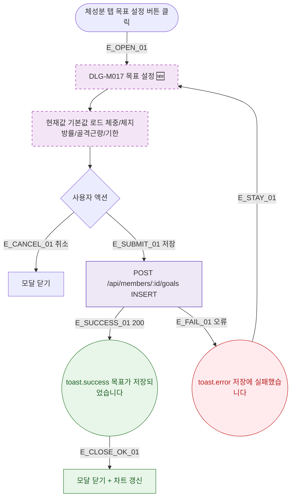

## 1. 목적

DLG-M017 목표 설정 다이얼로그의 열기/닫기/완료 생명주기를 명세한다. 🆕 미구현 기능.

## 2. 트리거/전제조건

- 체성분 탭 > "목표 설정" 버튼 클릭

## 3. 다이어그램

## 4. 엣지 설명

| 엣지 ID | 출발 | 도착 | 조건 |
|---------|------|------|------|
| E_OPEN_01 | 목표 설정 버튼 | 모달 열기 | - |
| E_CANCEL_01 | 취소 | 모달 닫기 | - |
| E_SUBMIT_01 | 저장 | API | 클릭 |
| E_SUCCESS_01 | API | toast.success | 200 |
| E_FAIL_01 | API | toast.error | 오류 |

## 5. TC 후보

| TC ID | 타입 | Given | When | Then |
|-------|------|-------|------|------|
| TC-DLG-M017-M1-01 | positive | 목표 설정 버튼 | 클릭 | 모달 열림, 현재값 기본값 |
| TC-DLG-M017-M1-02 | positive | API 200 | 저장 | toast.success + 닫힘 + 갱신 |
| TC-DLG-M017-M1-03 | exception | API 오류 | 저장 | toast.error + 모달 유지 |
| TC-DLG-M017-M1-04 | positive | 모달 열림 | 취소 | 모달 닫힘 |
