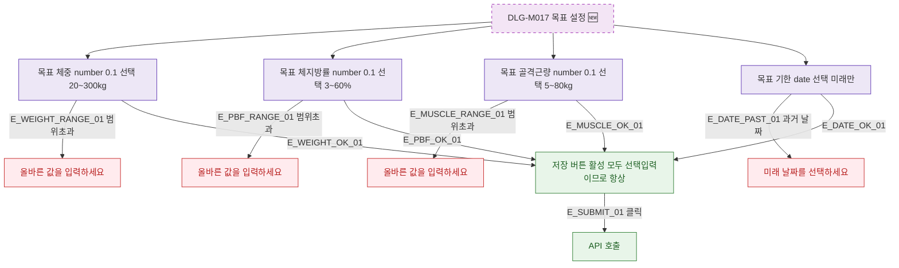

## 1. 목적

DLG-M017의 필드별 유효성 검증 흐름을 명세한다. 🆕 미구현 기능.

## 2. 트리거/전제조건

- DLG-M017 열린 상태

## 3. 다이어그램

## 4. 엣지 설명

| 엣지 ID | 출발 | 도착 | 조건 |
|---------|------|------|------|
| E_WEIGHT_RANGE_01 | 체중 | 에러 | 20~300 범위 초과 |
| E_PBF_RANGE_01 | 체지방률 | 에러 | 3~60 범위 초과 |
| E_DATE_PAST_01 | 기한 | 에러 | 과거 날짜 |

## 5. TC 후보

| TC ID | 타입 | Given | When | Then |
|-------|------|-------|------|------|
| TC-DLG-M017-M2-01 | positive | 모든 필드 빈값 | 저장 | API 호출 (선택 필드이므로) |
| TC-DLG-M017-M2-02 | negative | 체중=10 | 입력 | 에러 메시지 |
| TC-DLG-M017-M2-03 | negative | 기한=어제 | 선택 | 에러 메시지 |
