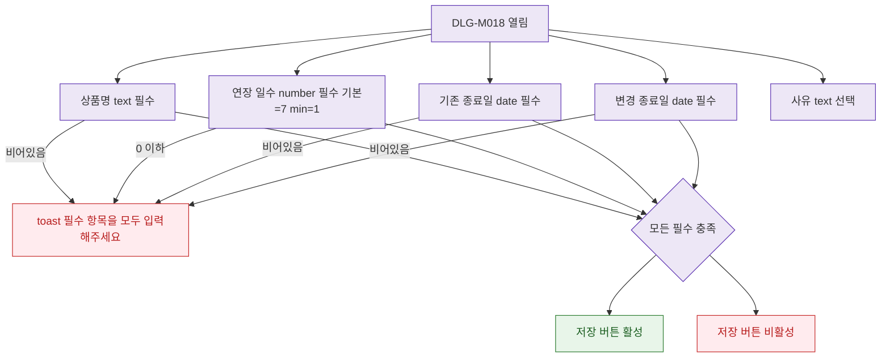

## 1. 목적

DLG-M018의 필드별 유효성 검증 흐름을 명세한다.

## 2. 트리거/전제조건

- DLG-M018 열린 상태

## 3. 다이어그램

## 4. 엣지 설명

| 출발 | 도착 | 조건 | |---------|------|------|------| | | 상품명 | 에러 toast | 비어있음 | | | 일수 | 에러 toast | 0 이하 | | | 전체 확인 | 버튼 활성 | 모두 충족 |
