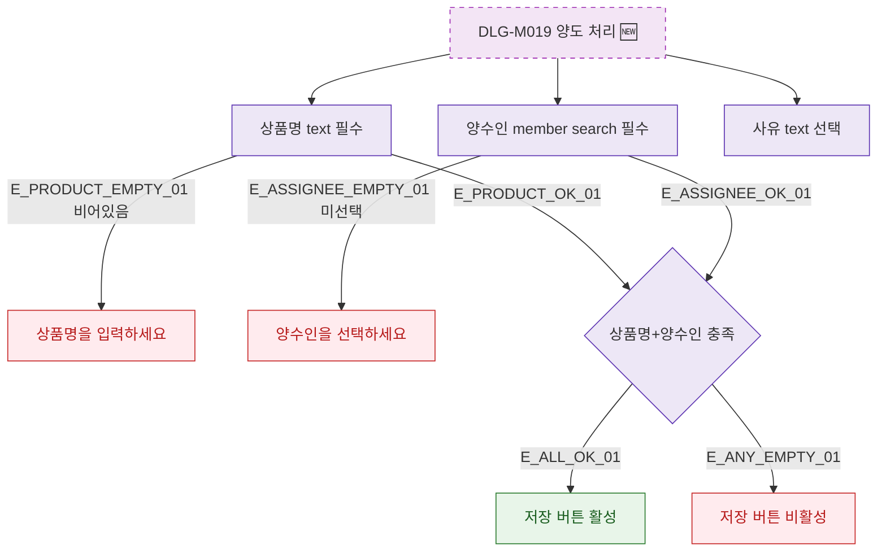

## 1. 목적

DLG-M019의 필드별 유효성 검증을 명세한다. 🆕 미구현 기능.

## 2. 트리거/전제조건

- DLG-M019 열린 상태

## 3. 다이어그램

## 4. 엣지 설명

| 엣지 ID | 출발 | 도착 | 조건 |
|---------|------|------|------|
| E_PRODUCT_EMPTY_01 | 상품명 | 에러 | 비어있음 |
| E_ASSIGNEE_EMPTY_01 | 양수인 | 에러 | 미선택 |
| E_ALL_OK_01 | 전체 확인 | 버튼 활성 | 모두 충족 |

## 5. TC 후보

| TC ID | 타입 | Given | When | Then |
|-------|------|-------|------|------|
| TC-DLG-M019-M2-01 | positive | 상품명+양수인 입력 | - | 버튼 활성 |
| TC-DLG-M019-M2-02 | negative | 상품명 비어있음 | 저장 | 에러 메시지 |
| TC-DLG-M019-M2-03 | negative | 양수인 미선택 | 저장 | 에러 메시지 |
