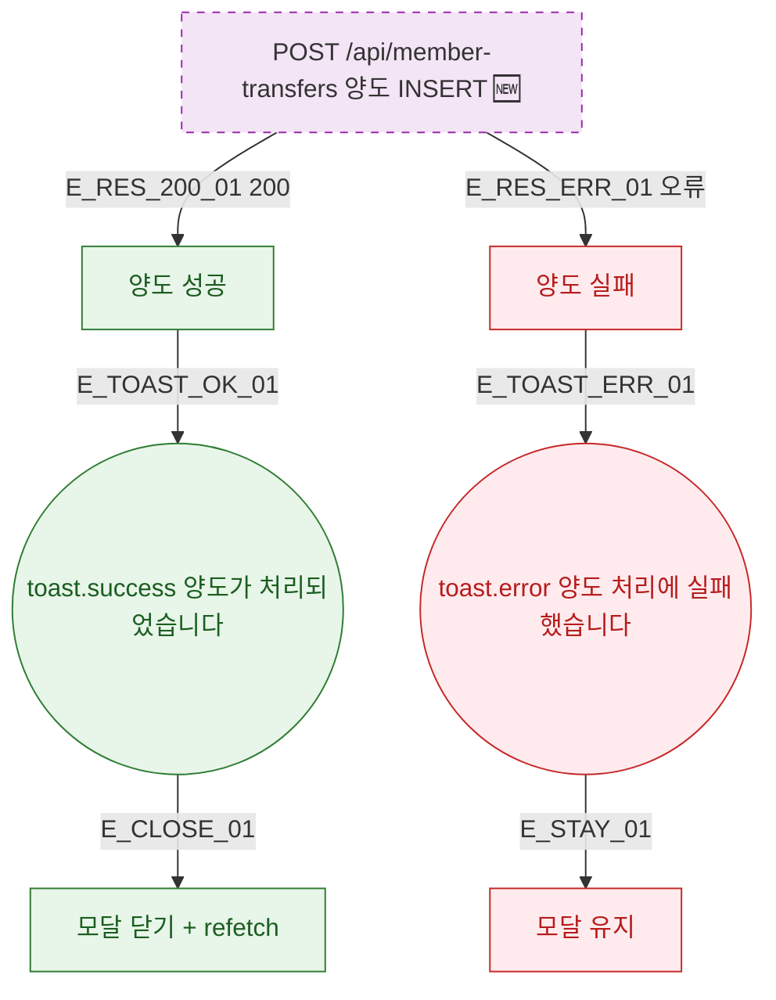

## 1. 목적

DLG-M019 양도 API 응답별 결과 분기를 명세한다. 🆕 미구현 기능.

## 2. 트리거/전제조건

- POST /api/member-transfers 호출 후

## 3. 다이어그램

## 4. 엣지 설명

| 엣지 ID | 출발 | 도착 | 조건 |
|---------|------|------|------|
| E_RES_200_01 | API | 성공 | 200 |
| E_RES_ERR_01 | API | 실패 | 오류 |
| E_CLOSE_01 | toast | 닫기 + 갱신 | - |

## 5. TC 후보

| TC ID | 타입 | Given | When | Then |
|-------|------|-------|------|------|
| TC-DLG-M019-M3-01 | positive | API 200 | 저장 | toast.success + 닫힘 + 갱신 |
| TC-DLG-M019-M3-02 | exception | API 오류 | 저장 | toast.error + 모달 유지 |
