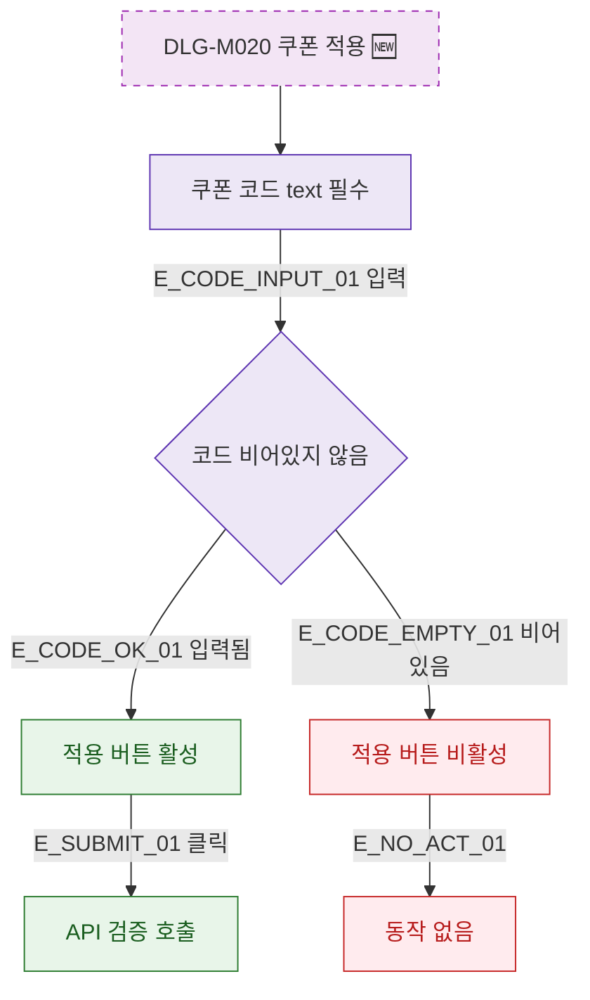

## 1. 목적

DLG-M020의 쿠폰 코드 입력 검증을 명세한다. 🆕 미구현 기능.

## 2. 트리거/전제조건

- DLG-M020 열린 상태

## 3. 다이어그램

## 4. 엣지 설명

| 엣지 ID | 출발 | 도착 | 조건 |
|---------|------|------|------|
| E_CODE_OK_01 | 코드 확인 | 버튼 활성 | 입력됨 |
| E_CODE_EMPTY_01 | 코드 확인 | 버튼 비활성 | 비어있음 |

## 5. TC 후보

| TC ID | 타입 | Given | When | Then |
|-------|------|-------|------|------|
| TC-DLG-M020-M2-01 | positive | 코드 입력 | 입력 | 버튼 활성 |
| TC-DLG-M020-M2-02 | negative | 빈값 | 입력 없음 | 버튼 비활성 |
