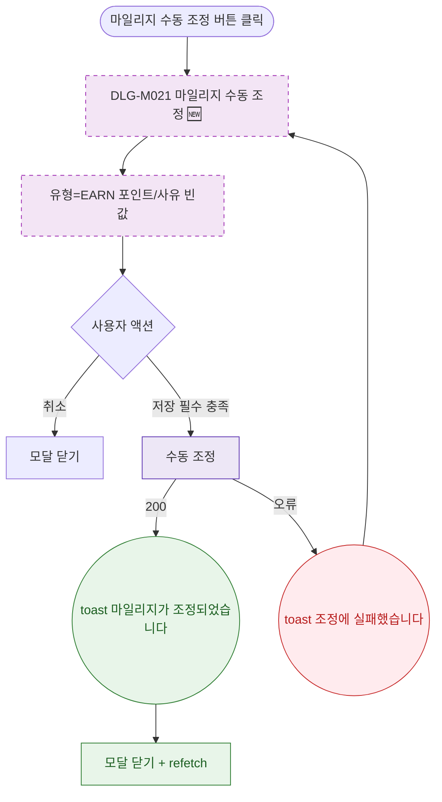

## 1. 목적

DLG-M021 마일리지 수동 조정 다이얼로그의 열기/닫기/완료 생명주기를 명세한다. 🆕 미구현 기능.

## 2. 트리거/전제조건

- 상세내역 탭 > 마일리지 서브탭 > "수동 조정" 버튼 클릭

## 3. 다이어그램

## 4. 엣지 설명

| 출발 | 도착 | 조건 | |---------|------|------|------| | | 수동 조정 버튼 | 모달 열기 | - | | | 저장 | API | 포인트+사유 충족 | | | API | toast | 200 | | | API | toast | 오류 |
