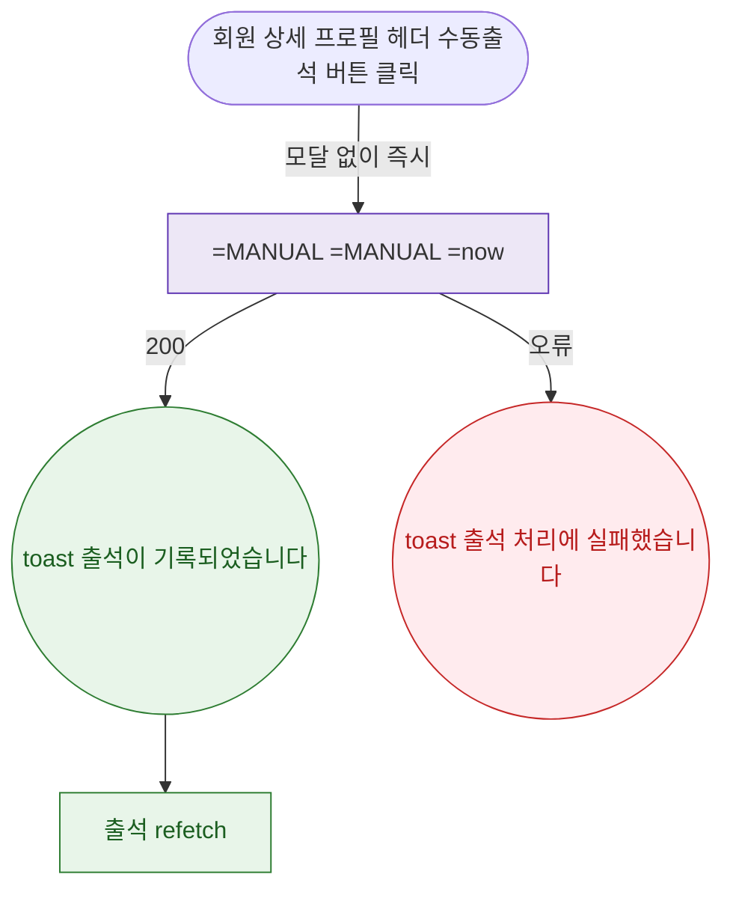

## 1. 목적

DLG-M022 수동 출석 등록(인라인 즉시 처리)의 트리거/완료 생명주기를 명세한다.

## 2. 트리거/전제조건

- 회원 상세 > 프로필 헤더 > "수동출석" 버튼 클릭

## 3. 다이어그램

## 4. 엣지 설명

| 출발 | 도착 | 조건 | |---------|------|------|------| | | 수동출석 버튼 | API 즉시 호출 | 모달 없음 | | | API | toast | 200 | | | API | toast | 오류 | | | toast | 출석 갱신 | - |
