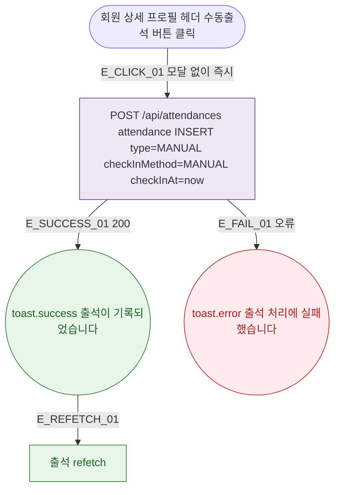

## 1. 목적

DLG-M022 수동 출석 등록(인라인 즉시 처리)의 트리거/완료 생명주기를 명세한다.

## 2. 트리거/전제조건

- 회원 상세 > 프로필 헤더 > "수동출석" 버튼 클릭

## 3. 다이어그램

## 4. 엣지 설명

| 엣지 ID | 출발 | 도착 | 조건 |
|---------|------|------|------|
| E_CLICK_01 | 수동출석 버튼 | API 즉시 호출 | 모달 없음 |
| E_SUCCESS_01 | API | toast.success | 200 |
| E_FAIL_01 | API | toast.error | 오류 |
| E_REFETCH_01 | toast | 출석 갱신 | - |

## 5. TC 후보

| TC ID | 타입 | Given | When | Then |
|-------|------|-------|------|------|
| TC-DLG-M022-M1-01 | positive | 프로필 헤더 | 수동출석 클릭 | 즉시 API 호출 |
| TC-DLG-M022-M1-02 | positive | API 200 | 수동출석 | toast.success + 출석 갱신 |
| TC-DLG-M022-M1-03 | exception | API 오류 | 수동출석 | toast.error |
