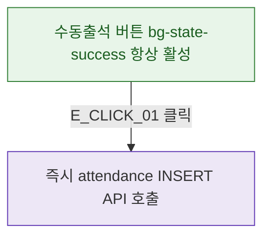

## 1. 목적

DLG-M022는 모달/입력 필드 없이 즉시 실행되므로 버튼 상태만 명세한다.

## 2. 트리거/전제조건

- 회원 상세 프로필 헤더 표시 상태

## 3. 다이어그램

## 4. 엣지 설명

| 엣지 ID | 출발 | 도착 | 조건 |
|---------|------|------|------|
| E_CLICK_01 | 수동출석 버튼 | API | 클릭 (항상 활성) |

## 5. TC 후보

| TC ID | 타입 | Given | When | Then |
|-------|------|-------|------|------|
| TC-DLG-M022-M2-01 | positive | 프로필 헤더 | 버튼 표시 | 항상 활성 상태 |
| TC-DLG-M022-M2-02 | positive | 버튼 클릭 | - | 확인 모달 없이 즉시 API |
