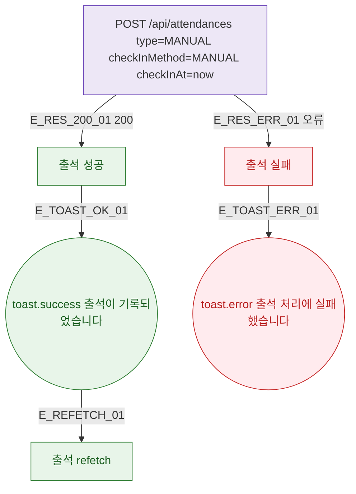

## 1. 목적

DLG-M022 수동 출석 API 응답별 결과 분기를 명세한다.

## 2. 트리거/전제조건

- POST /api/attendances 호출 후

## 3. 다이어그램

## 4. 엣지 설명

| 엣지 ID | 출발 | 도착 | 조건 |
|---------|------|------|------|
| E_RES_200_01 | API | 성공 | 200 |
| E_RES_ERR_01 | API | 실패 | 오류 |
| E_TOAST_OK_01 | 성공 | toast.success | - |
| E_REFETCH_01 | toast | 출석 갱신 | - |

## 5. TC 후보

| TC ID | 타입 | Given | When | Then |
|-------|------|-------|------|------|
| TC-DLG-M022-M3-01 | positive | API 200 | 수동출석 | toast.success + 출석 갱신 |
| TC-DLG-M022-M3-02 | exception | API 오류 | 수동출석 | toast.error |
