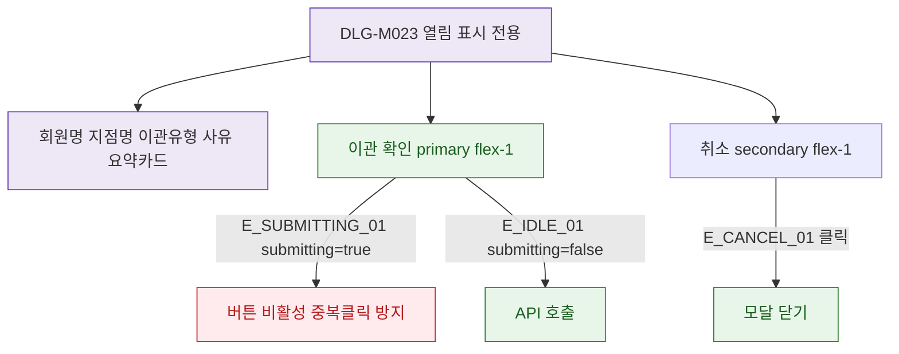

## 1. 목적

DLG-M023은 표시 전용 ConfirmDialog이므로 버튼 상태와 submitting 조건을 명세한다.

## 2. 트리거/전제조건

- DLG-M023 열린 상태

## 3. 다이어그램

## 4. 엣지 설명

| 엣지 ID | 출발 | 도착 | 조건 |
|---------|------|------|------|
| E_SUBMITTING_01 | 이관 확인 | 비활성 | submitting=true |
| E_IDLE_01 | 이관 확인 | API | submitting=false |
| E_CANCEL_01 | 취소 | 모달 닫기 | 클릭 |

## 5. TC 후보

| TC ID | 타입 | Given | When | Then |
|-------|------|-------|------|------|
| TC-DLG-M023-M2-01 | positive | 모달 열림 | 이관 확인 클릭 | API 호출 |
| TC-DLG-M023-M2-02 | negative | submitting=true | 이관 확인 클릭 | 버튼 비활성 중복 방지 |
| TC-DLG-M023-M2-03 | positive | 모달 열림 | 정보 표시 | 회원명/지점명 bold 확인 |
