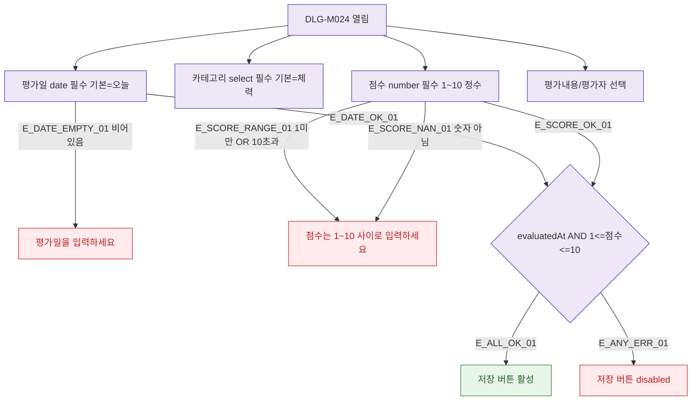

## 1. 목적

DLG-M024의 필드별 유효성 검증 흐름을 명세한다.

## 2. 트리거/전제조건

- DLG-M024 열린 상태

## 3. 다이어그램

## 4. 엣지 설명

| 엣지 ID | 출발 | 도착 | 조건 |
|---------|------|------|------|
| E_DATE_EMPTY_01 | 평가일 | 에러 | 비어있음 |
| E_SCORE_RANGE_01 | 점수 | 에러 | 1~10 범위 초과 |
| E_ALL_OK_01 | 전체 확인 | 버튼 활성 | 모두 충족 |

## 5. TC 후보

| TC ID | 타입 | Given | When | Then |
|-------|------|-------|------|------|
| TC-DLG-M024-M2-01 | positive | 평가일+점수=7 | 입력 | 버튼 활성 |
| TC-DLG-M024-M2-02 | negative | 점수=0 | 입력 | 에러 메시지 |
| TC-DLG-M024-M2-03 | negative | 점수=11 | 입력 | 에러 메시지 |
| TC-DLG-M024-M2-04 | negative | 평가일 비어있음 | 저장 | 버튼 비활성 |
