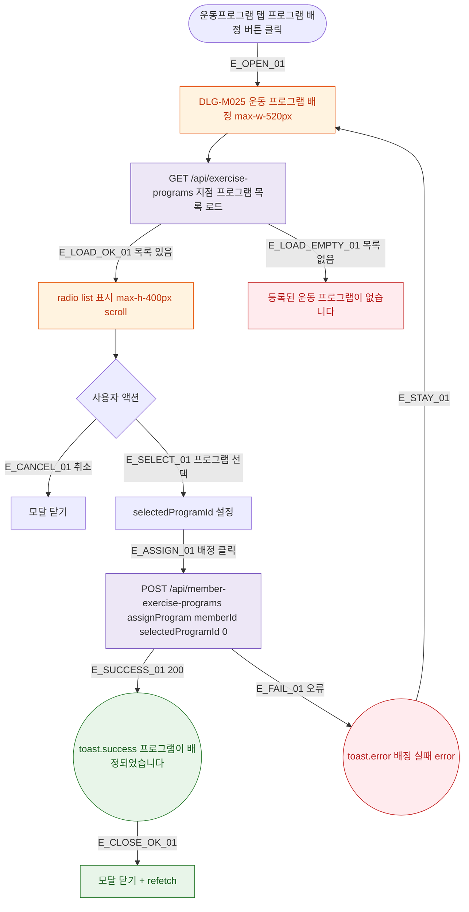

## 1. 목적

DLG-M025 운동 프로그램 배정 다이얼로그의 열기/닫기/완료 생명주기를 명세한다.

## 2. 트리거/전제조건

- 운동프로그램 탭 > "프로그램 배정" 버튼 클릭

## 3. 다이어그램

## 4. 엣지 설명

| 엣지 ID | 출발 | 도착 | 조건 |
|---------|------|------|------|
| E_OPEN_01 | 배정 버튼 | 모달 열기 | - |
| E_LOAD_EMPTY_01 | 목록 로드 | 빈 상태 | 프로그램 없음 |
| E_SELECT_01 | radio | 선택됨 | 클릭 |
| E_ASSIGN_01 | 배정 버튼 | API | selectedProgramId 있음 |
| E_SUCCESS_01 | API | toast.success | 200 |

## 5. TC 후보

| TC ID | 타입 | Given | When | Then |
|-------|------|-------|------|------|
| TC-DLG-M025-M1-01 | positive | 프로그램 선택 후 | 배정 200 | toast.success + 닫힘 + 갱신 |
| TC-DLG-M025-M1-02 | positive | 프로그램 없음 | 모달 열기 | 빈 상태 메시지 |
| TC-DLG-M025-M1-03 | exception | API 오류 | 배정 | toast.error + 모달 유지 |
| TC-DLG-M025-M1-04 | positive | 모달 열림 | 취소 | 모달 닫힘 |
