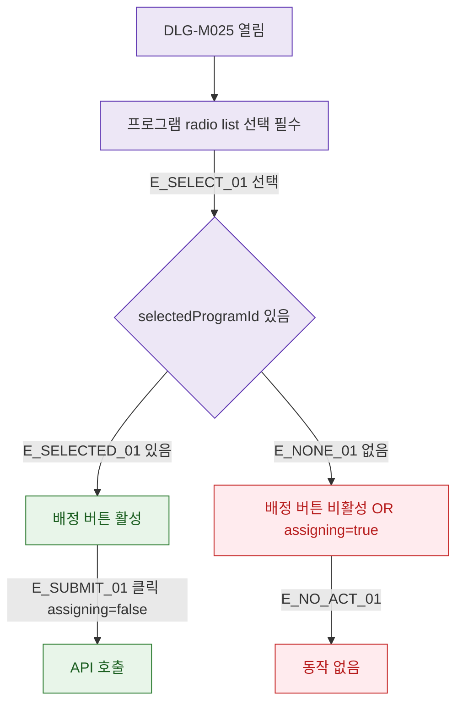

## 1. 목적

DLG-M025의 프로그램 선택 유효성 검증을 명세한다.

## 2. 트리거/전제조건

- DLG-M025 열린 상태

## 3. 다이어그램

## 4. 엣지 설명

| 엣지 ID | 출발 | 도착 | 조건 |
|---------|------|------|------|
| E_SELECTED_01 | 선택 확인 | 버튼 활성 | selectedProgramId 있음 |
| E_NONE_01 | 선택 확인 | 버튼 비활성 | 미선택 OR assigning |
| E_SUBMIT_01 | 버튼 활성 | API | assigning=false |

## 5. TC 후보

| TC ID | 타입 | Given | When | Then |
|-------|------|-------|------|------|
| TC-DLG-M025-M2-01 | positive | 프로그램 선택 | 클릭 | 배정 버튼 활성 |
| TC-DLG-M025-M2-02 | negative | 미선택 | 배정 클릭 | 버튼 비활성 |
| TC-DLG-M025-M2-03 | negative | assigning=true | 배정 클릭 | 버튼 비활성 (중복 방지) |
