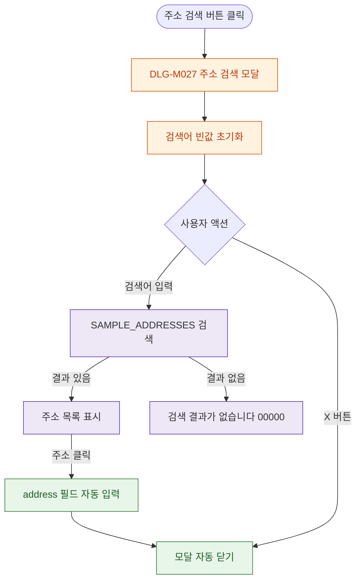

## 1. 목적

DLG-M027 주소 검색 다이얼로그의 열기/닫기/완료 생명주기를 명세한다.

## 2. 트리거/전제조건

- 회원 등록/수정 Step 2 > "주소 검색" 버튼 클릭

## 3. 다이어그램

## 4. 엣지 설명

| 출발 | 도착 | 조건 | |---------|------|------|------| | | 주소 검색 버튼 | 모달 열기 | - | | | 검색어 입력 | SAMPLE_ADDRESSES 검색 | - | | | 주소 클릭 | 자동 입력 | - | | | 자동 입력 | 모달 닫기 | 선택 시 자동 | | | X 버튼 | 모달 닫기 | - |
