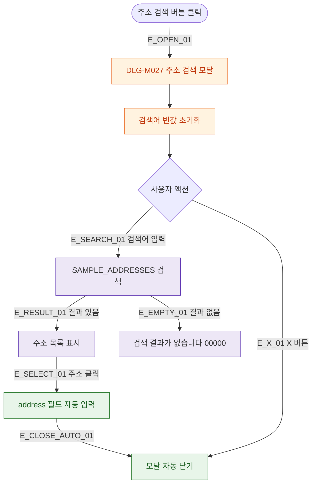

## 1. 목적

DLG-M027 주소 검색 다이얼로그의 열기/닫기/완료 생명주기를 명세한다.

## 2. 트리거/전제조건

- 회원 등록/수정 Step 2 > "주소 검색" 버튼 클릭

## 3. 다이어그램

## 4. 엣지 설명

| 엣지 ID | 출발 | 도착 | 조건 |
|---------|------|------|------|
| E_OPEN_01 | 주소 검색 버튼 | 모달 열기 | - |
| E_SEARCH_01 | 검색어 입력 | SAMPLE_ADDRESSES 검색 | - |
| E_SELECT_01 | 주소 클릭 | 자동 입력 | - |
| E_CLOSE_AUTO_01 | 자동 입력 | 모달 닫기 | 선택 시 자동 |
| E_X_01 | X 버튼 | 모달 닫기 | - |

## 5. TC 후보

| TC ID | 타입 | Given | When | Then |
|-------|------|-------|------|------|
| TC-DLG-M027-M1-01 | positive | 검색어 입력 | 검색 | 주소 목록 표시 |
| TC-DLG-M027-M1-02 | positive | 주소 클릭 | 선택 | address 필드 자동 입력 + 모달 닫힘 |
| TC-DLG-M027-M1-03 | positive | 없는 주소 | 검색 | 빈 결과 표시 |
| TC-DLG-M027-M1-04 | positive | 모달 열림 | X 버튼 | 모달 닫힘 |
