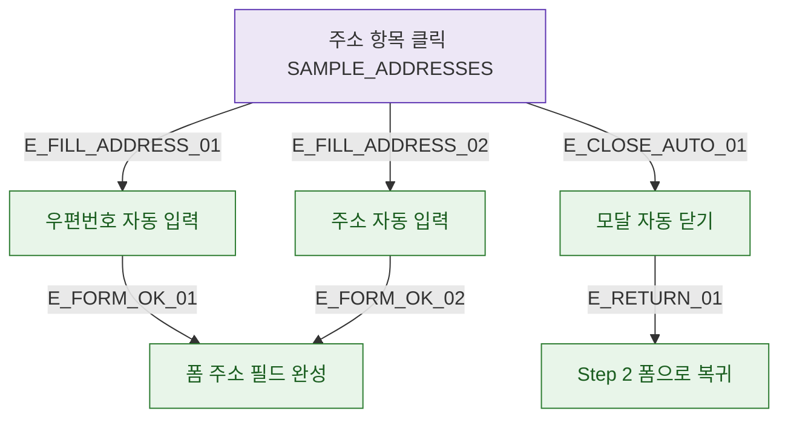

## 1. 목적

DLG-M027 주소 선택 후 결과 분기를 명세한다. 외부 API 없음 (Mock SAMPLE_ADDRESSES).

## 2. 트리거/전제조건

- 주소 목록에서 항목 클릭

## 3. 다이어그램

## 4. 엣지 설명

| 엣지 ID | 출발 | 도착 | 조건 |
|---------|------|------|------|
| E_FILL_ADDRESS_01 | 선택 | 우편번호 입력 | - |
| E_FILL_ADDRESS_02 | 선택 | 주소 입력 | - |
| E_CLOSE_AUTO_01 | 선택 | 모달 닫기 | 자동 |
| E_RETURN_01 | 닫기 | Step 2 복귀 | - |

## 5. TC 후보

| TC ID | 타입 | Given | When | Then |
|-------|------|-------|------|------|
| TC-DLG-M027-M3-01 | positive | 주소 선택 | 클릭 | postcode+address 자동 입력 |
| TC-DLG-M027-M3-02 | positive | 주소 선택 | 클릭 | 모달 자동 닫힘 |
| TC-DLG-M027-M3-03 | positive | 모달 닫힘 후 | - | Step 2 폼으로 복귀 |
