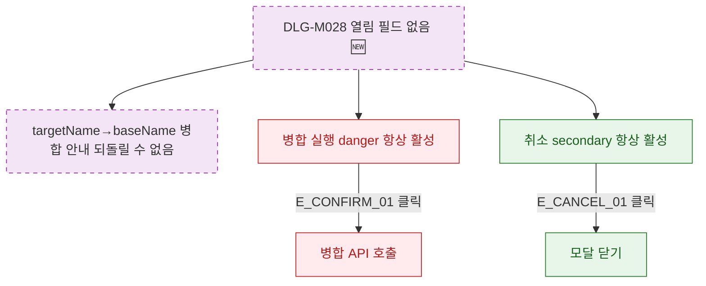

## 1. 목적

DLG-M028은 표시 전용 ConfirmDialog이므로 버튼 상태만 명세한다. 🆕 미구현 기능.

## 2. 트리거/전제조건

- DLG-M028 열린 상태

## 3. 다이어그램

## 4. 엣지 설명

| 엣지 ID | 출발 | 도착 | 조건 |
|---------|------|------|------|
| E_CONFIRM_01 | 병합 실행 버튼 | API | 클릭 |
| E_CANCEL_01 | 취소 버튼 | 모달 닫기 | 클릭 |

## 5. TC 후보

| TC ID | 타입 | Given | When | Then |
|-------|------|-------|------|------|
| TC-DLG-M028-M2-01 | positive | 모달 열림 | 병합 실행 클릭 | API 호출 |
| TC-DLG-M028-M2-02 | positive | 모달 열림 | 취소 클릭 | 모달 닫힘 |
| TC-DLG-M028-M2-03 | positive | 모달 열림 | 표시 확인 | 대상/기준 회원명 표시 |
