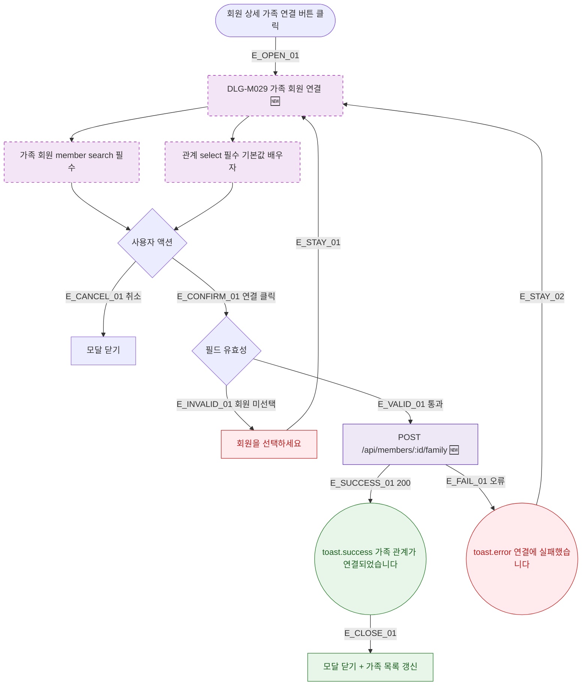

## 1. 목적

DLG-M029 가족 회원 연결 다이얼로그의 열기/닫기/완료 생명주기를 명세한다. 🆕 미구현 기능.

## 2. 트리거/전제조건

- 회원 상세 > "가족 연결" 버튼 클릭

## 3. 다이어그램

## 4. 엣지 설명

| 엣지 ID | 출발 | 도착 | 조건 |
|---------|------|------|------|
| E_OPEN_01 | 가족 연결 버튼 | 모달 열기 | - |
| E_CANCEL_01 | 취소 | 모달 닫기 | - |
| E_CONFIRM_01 | 연결 버튼 | 유효성 검사 | 클릭 |
| E_INVALID_01 | 유효성 실패 | 에러 표시 | 회원 미선택 |
| E_VALID_01 | 유효성 통과 | API 호출 | - |
| E_SUCCESS_01 | API | toast.success | 200 |
| E_CLOSE_01 | toast | 모달 닫기 + 목록 갱신 | - |
| E_FAIL_01 | API | toast.error | 오류 |
| E_STAY_01 | 에러 | 모달 유지 | - |
| E_STAY_02 | toast.error | 모달 유지 | - |

## 5. TC 후보

| TC ID | 타입 | Given | When | Then |
|-------|------|-------|------|------|
| TC-DLG-M029-M1-01 | positive | 가족 연결 버튼 | 클릭 | 모달 열림 + 필드 표시 |
| TC-DLG-M029-M1-02 | positive | 회원 선택 + 관계 선택 | 연결 클릭 | API 호출 + toast.success + 모달 닫힘 |
| TC-DLG-M029-M1-03 | negative | 회원 미선택 | 연결 클릭 | "회원을 선택하세요" 에러 + 모달 유지 |
| TC-DLG-M029-M1-04 | exception | API 오류 | 연결 클릭 | toast.error + 모달 유지 |
| TC-DLG-M029-M1-05 | positive | 모달 열림 | 취소 클릭 | 모달 닫힘 |
