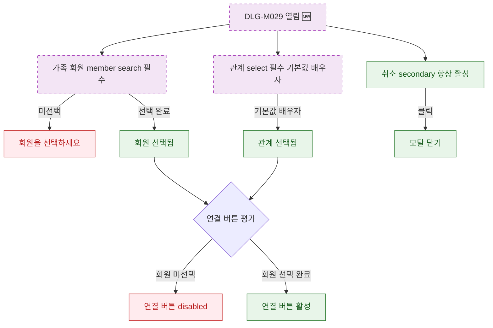

## 1. 목적

DLG-M029 가족 회원 연결 다이얼로그의 필드 유효성 조건 및 버튼 활성화 상태를 명세한다. 🆕 미구현 기능.

## 2. 트리거/전제조건

- DLG-M029 열린 상태

## 3. 다이어그램

## 4. 엣지 설명

| 출발 | 도착 | 조건 | |---------|------|------|------| | | 가족 회원 | 에러 | 미선택 | | | 가족 회원 | 선택됨 | 선택 완료 | | | 관계 | 선택됨 | 기본값 or 선택 | | | 버튼 평가 | disabled | 회원 미선택 | | | 버튼 평가 | 활성 | 회원 선택 완료 | | | 취소 버튼 | 모달 닫기 | 클릭 |
