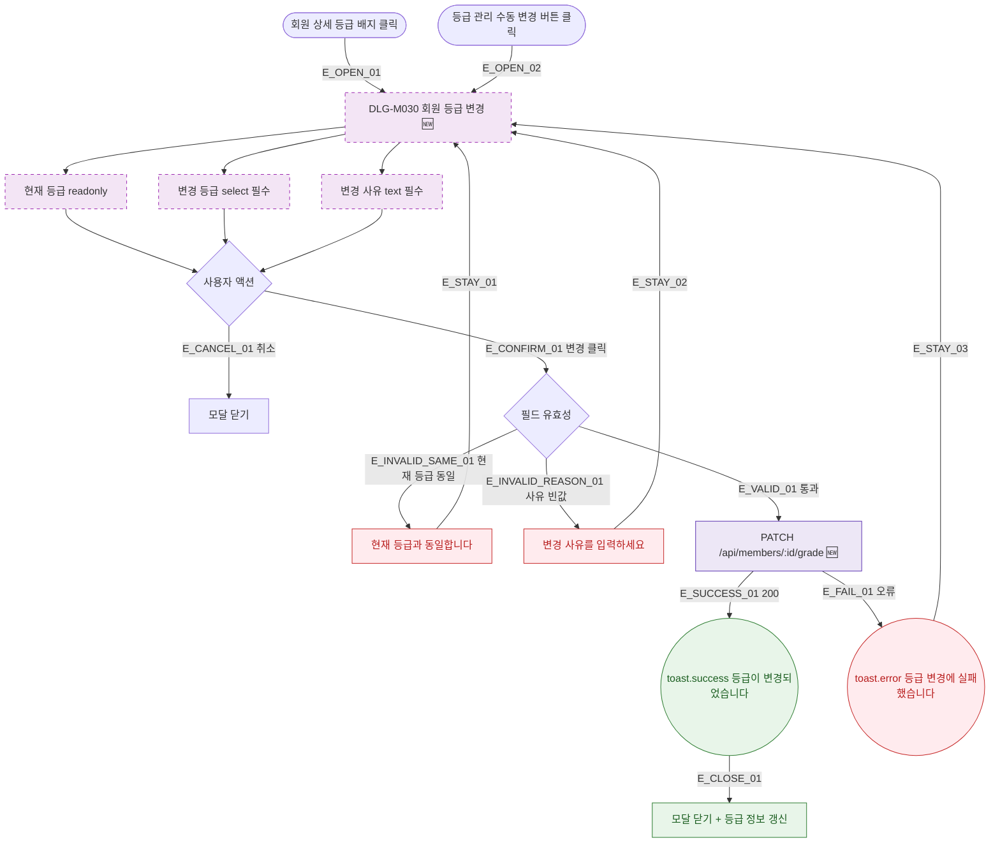

## 1. 목적

DLG-M030 회원 등급 변경 다이얼로그의 열기/닫기/완료 생명주기를 명세한다. 🆕 미구현 기능.

## 2. 트리거/전제조건

- 회원 상세 > 등급 배지 클릭 (관리자) 또는 등급 관리 > "수동 변경" 버튼 클릭

## 3. 다이어그램

## 4. 엣지 설명

| 엣지 ID | 출발 | 도착 | 조건 |
|---------|------|------|------|
| E_OPEN_01 | 등급 배지 클릭 | 모달 열기 | 회원 상세 |
| E_OPEN_02 | 수동 변경 버튼 | 모달 열기 | 등급 관리 |
| E_CANCEL_01 | 취소 | 모달 닫기 | - |
| E_CONFIRM_01 | 변경 버튼 | 유효성 검사 | 클릭 |
| E_INVALID_SAME_01 | 유효성 실패 | 에러 표시 | 현재 등급 동일 |
| E_INVALID_REASON_01 | 유효성 실패 | 에러 표시 | 사유 빈값 |
| E_VALID_01 | 유효성 통과 | API 호출 | - |
| E_SUCCESS_01 | API | toast.success | 200 |
| E_CLOSE_01 | toast | 모달 닫기 + 갱신 | - |
| E_FAIL_01 | API | toast.error | 오류 |

## 5. TC 후보

| TC ID | 타입 | Given | When | Then |
|-------|------|-------|------|------|
| TC-DLG-M030-M1-01 | positive | 등급 배지 클릭 | - | 모달 열림 + 현재 등급 표시 |
| TC-DLG-M030-M1-02 | positive | 수동 변경 클릭 | - | 모달 열림 + 현재 등급 표시 |
| TC-DLG-M030-M1-03 | positive | 다른 등급 선택 + 사유 입력 | 변경 클릭 | API 호출 + toast.success + 모달 닫힘 |
| TC-DLG-M030-M1-04 | negative | 현재 등급 동일 선택 | 변경 클릭 | "현재 등급과 동일합니다" + 모달 유지 |
| TC-DLG-M030-M1-05 | negative | 사유 빈값 | 변경 클릭 | "변경 사유를 입력하세요" + 모달 유지 |
| TC-DLG-M030-M1-06 | exception | API 오류 | 변경 클릭 | toast.error + 모달 유지 |
| TC-DLG-M030-M1-07 | positive | 모달 열림 | 취소 클릭 | 모달 닫힘 |
