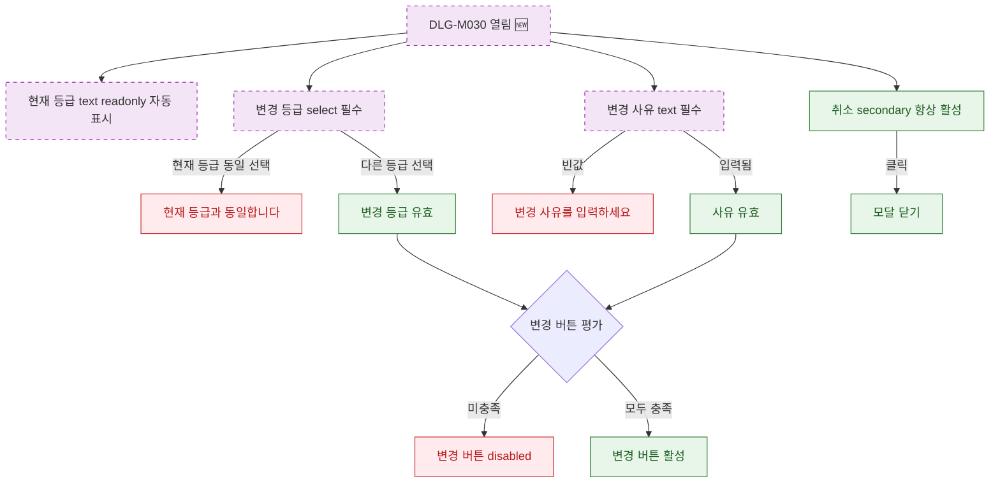

## 1. 목적

DLG-M030 회원 등급 변경 다이얼로그의 필드 유효성 조건 및 버튼 활성화 상태를 명세한다. 🆕 미구현 기능.

## 2. 트리거/전제조건

- DLG-M030 열린 상태

## 3. 다이어그램

## 4. 엣지 설명

| 출발 | 도착 | 조건 | |---------|------|------|------| | | 변경 등급 | 에러 | 현재 등급과 동일 | | | 변경 등급 | 유효 | 다른 등급 선택 | | | 변경 사유 | 에러 | 빈값 | | | 변경 사유 | 유효 | 입력됨 | | | 버튼 평가 | disabled | 조건 미충족 | | | 버튼 평가 | 활성 | 모두 충족 | | | 취소 버튼 | 모달 닫기 | 클릭 |
