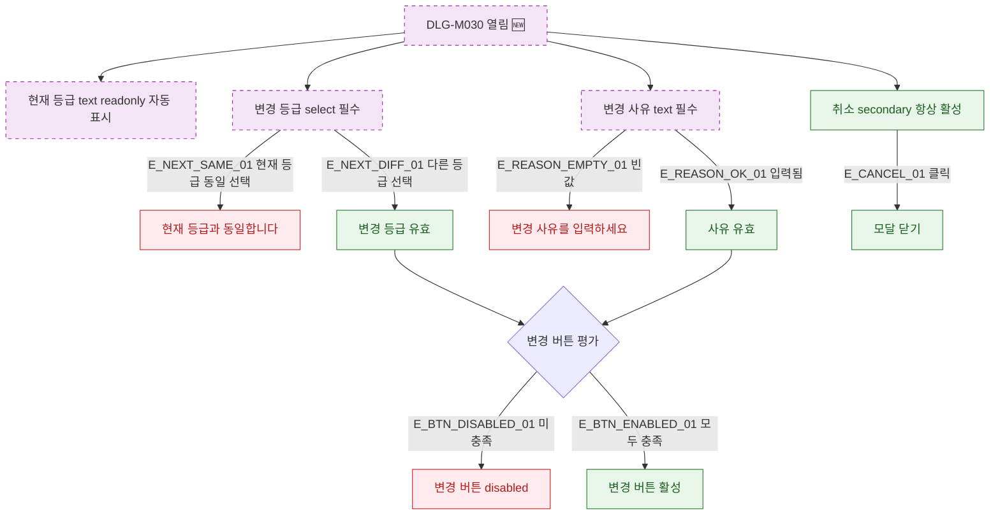

## 1. 목적

DLG-M030 회원 등급 변경 다이얼로그의 필드 유효성 조건 및 버튼 활성화 상태를 명세한다. 🆕 미구현 기능.

## 2. 트리거/전제조건

- DLG-M030 열린 상태

## 3. 다이어그램

## 4. 엣지 설명

| 엣지 ID | 출발 | 도착 | 조건 |
|---------|------|------|------|
| E_NEXT_SAME_01 | 변경 등급 | 에러 | 현재 등급과 동일 |
| E_NEXT_DIFF_01 | 변경 등급 | 유효 | 다른 등급 선택 |
| E_REASON_EMPTY_01 | 변경 사유 | 에러 | 빈값 |
| E_REASON_OK_01 | 변경 사유 | 유효 | 입력됨 |
| E_BTN_DISABLED_01 | 버튼 평가 | disabled | 조건 미충족 |
| E_BTN_ENABLED_01 | 버튼 평가 | 활성 | 모두 충족 |
| E_CANCEL_01 | 취소 버튼 | 모달 닫기 | 클릭 |

## 5. TC 후보

| TC ID | 타입 | Given | When | Then |
|-------|------|-------|------|------|
| TC-DLG-M030-M2-01 | positive | 모달 열림 | 초기 상태 확인 | 현재 등급 readonly 표시, 변경 버튼 disabled |
| TC-DLG-M030-M2-02 | negative | 현재 등급 동일 선택 | 필드 확인 | "현재 등급과 동일합니다" 에러 표시 |
| TC-DLG-M030-M2-03 | negative | 사유 빈값 | 버튼 상태 확인 | 변경 버튼 disabled 유지 |
| TC-DLG-M030-M2-04 | positive | 다른 등급 선택 + 사유 입력 | 버튼 상태 확인 | 변경 버튼 활성 |
| TC-DLG-M030-M2-05 | positive | 모달 열림 | 취소 클릭 | 모달 닫힘 |
