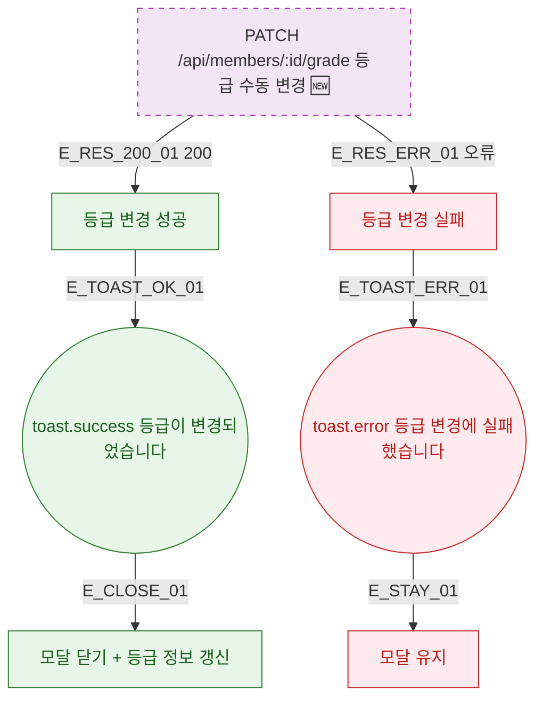

## 1. 목적

DLG-M030 등급 변경 API 응답별 결과 분기를 명세한다. 🆕 미구현 기능.

## 2. 트리거/전제조건

- PATCH /api/members/:id/grade 호출 후

## 3. 다이어그램

## 4. 엣지 설명

| 엣지 ID | 출발 | 도착 | 조건 |
|---------|------|------|------|
| E_RES_200_01 | API | 성공 | 200 |
| E_RES_ERR_01 | API | 실패 | 오류 |
| E_TOAST_OK_01 | 성공 | toast.success | - |
| E_CLOSE_01 | toast | 모달 닫기 + 등급 갱신 | - |
| E_TOAST_ERR_01 | 실패 | toast.error | - |
| E_STAY_01 | toast.error | 모달 유지 | - |

## 5. TC 후보

| TC ID | 타입 | Given | When | Then |
|-------|------|-------|------|------|
| TC-DLG-M030-M3-01 | positive | API 200 | 등급 변경 실행 | toast.success + 모달 닫힘 + 등급 정보 갱신 |
| TC-DLG-M030-M3-02 | exception | API 오류 | 등급 변경 실행 | toast.error + 모달 유지 |
