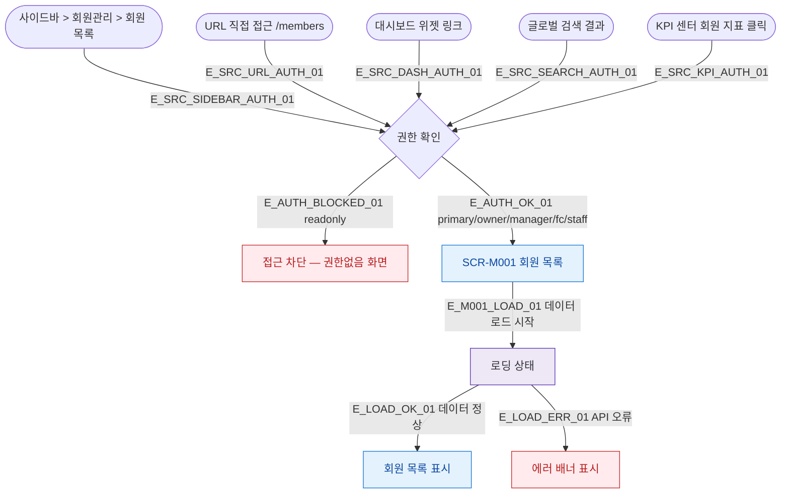

## 1. 목적

SCR-M001 회원 목록 화면에 진입할 수 있는 모든 경로를 명세한다. 진입 TC의 Given 조건 원천.

## 2. 전제조건

- 사용자가 로그인 상태이다.
- 세션이 유효하다.

## 3. 다이어그램

## 4. 엣지 설명 테이블

| 엣지 ID | 출발 | 도착 | 라벨 / 조건 |
|---------|------|------|-------------|
| E_SRC_SIDEBAR_AUTH_01 | 사이드바 | 권한 확인 | 사이드바 회원 목록 클릭 |
| E_SRC_URL_AUTH_01 | URL 직접 접근 | 권한 확인 | /members URL 진입 |
| E_SRC_DASH_AUTH_01 | 대시보드 위젯 | 권한 확인 | 대시보드 회원 위젯 클릭 |
| E_SRC_SEARCH_AUTH_01 | 글로벌 검색 | 권한 확인 | 검색 결과에서 회원 목록 이동 |
| E_SRC_KPI_AUTH_01 | KPI 센터 | 권한 확인 | KPI 회원 지표 클릭 |
| E_AUTH_BLOCKED_01 | 권한 확인 | 접근 차단 | readonly 역할 → 접근 불가 |
| E_AUTH_OK_01 | 권한 확인 | SCR-M001 | primary/owner/manager/fc/staff |
| E_M001_LOAD_01 | SCR-M001 | 로딩 | 화면 마운트 후 데이터 요청 |
| E_LOAD_OK_01 | 로딩 | 목록 표시 | API 정상 응답 |
| E_LOAD_ERR_01 | 로딩 | 에러 배너 | API 오류 |

## 5. TC 후보

| TC ID | 타입 | Given | When | Then |
|-------|------|-------|------|------|
| TC-M001-F1-01 | positive | manager 로그인 | 사이드바 > 회원 목록 클릭 | SCR-M001 정상 진입, 목록 표시 |
| TC-M001-F1-02 | positive | manager 로그인 | /members URL 직접 접근 | SCR-M001 정상 진입 |
| TC-M001-F1-03 | negative | readonly 로그인 | 사이드바 > 회원 목록 클릭 | 접근 차단 화면 표시 |
| TC-M001-F1-04 | positive | manager 로그인 | 대시보드 회원 위젯 클릭 | SCR-M001 진입 |
| TC-M001-F1-05 | positive | manager 로그인 | 글로벌 검색 > 회원 목록 링크 | SCR-M001 진입 |
| TC-M001-F1-06 | positive | manager 로그인 | KPI 센터 회원 지표 클릭 | SCR-M001 진입 |
| TC-M001-F1-07 | exception | manager 로그인 | SCR-M001 진입 중 API 오류 | 에러 배너 표시 |
