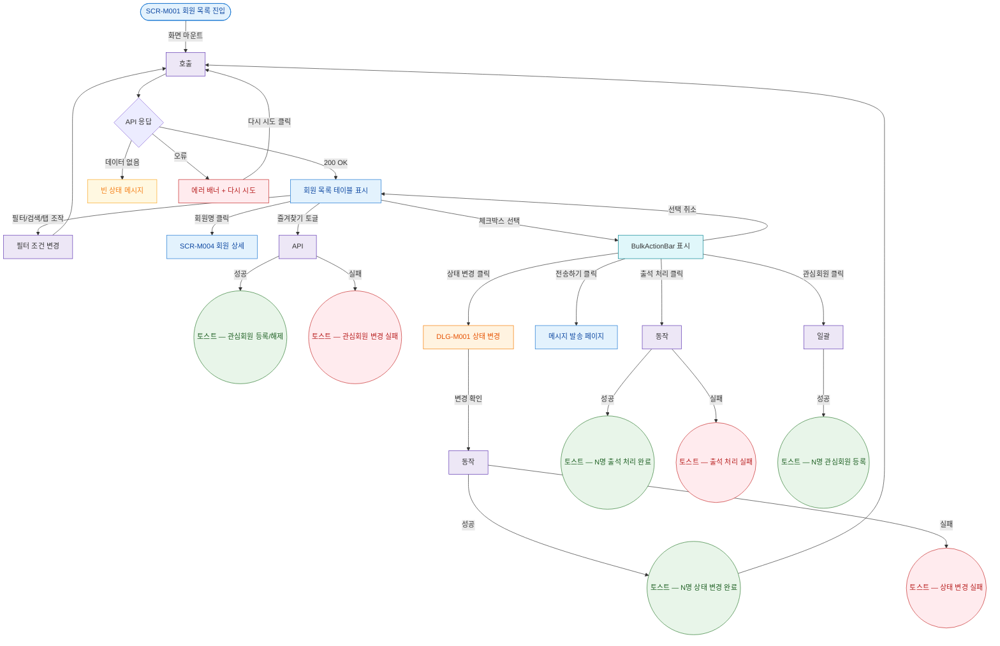

## 1. 목적

SCR-M001의 정상 시나리오(Happy Path)를 명세한다. 진입→필터→검색→행 선택→상세 이동 또는 벌크 액션의 전체 흐름. 성공/검증실패/시스템에러 3갈래 분기 강제.

## 2. 전제조건

- primary 중 하나로 로그인되어 있다.
- SCR-M001에 진입 완료 후 데이터 로드가 성공한 상태이다.

## 3. 다이어그램

## 4. 엣지 설명 테이블

| 출발 | 도착 | 라벨 / 조건 | |---------|------|------|-------------| | | SCR-M001 | API 호출 | 화면 마운트 시 자동 호출 | | | API 응답 | 목록 표시 | 200 OK, 데이터 있음 | | | API 응답 | 빈 상태 | 200 OK, 데이터 없음 | | | API 응답 | 에러 배너 | 4xx/5xx/네트워크 오류 | | | 에러 배너 | API 호출 | 다시 시도 버튼 클릭 | | | 목록 | 필터 | 탭/검색/필터 조작 | | | 필터 | API 호출 | 쿼리 파라미터 변경 후 재조회 | | | 목록 | 회원 상세 | 회원명 클릭 | | | 목록 | 즐겨찾기 API | ★ 토글 클릭 | | | 즐겨찾기 API | 성공 토스트 | 성공 | | | 즐겨찾기 API | 실패 토스트 | 실패 | | | 목록 | BulkActionBar | 체크박스 1개 이상 선택 | | | BulkActionBar | DLG-M001 | 상태 변경 클릭 | | | BulkActionBar | 메시지 발송 | 전송하기 클릭 | | | BulkActionBar | 출석 API | 출석 처리 클릭 | | | BulkActionBar | 즐겨찾기 일괄 | 관심회원 클릭 | | | BulkActionBar | 목록 | 선택 취소 | | | DLG-M001 | status API | 변경 확인 클릭 | | | status API | 성공 토스트 | 성공 | | | status API | 실패 토스트 | 실패 | | | 성공 토스트 | API 호출 | 목록 재조회 | | | 출석 API | 성공 토스트 | 성공 | | | 출석 API | 실패 토스트 | 실패 |
