## 1. 목적

SCR-M001의 모든 필터/검색/정렬/페이지네이션 조작을 명세한다. 쿼리 TC 원천.

## 2. 전제조건

- SCR-M001 회원 목록이 정상 표시 상태이다.

## 3. 다이어그램

```mermaid
flowchart TD
  SCR_M001[SCR-M001 회원 목록]

  subgraph MAIN_TAB [메인 탭 — 1차 분류]
    TAB_ALL[회원 전체]
    TAB_PRODUCT[보유상품별]
    TAB_MEMBERSHIP[이용권 목록]
  end

  subgraph STATUS_TAB [상태 서브탭 — 회원 전체 탭 내]
    STAB_ALL[전체]
    STAB_ACTIVE[활성]
    STAB_EXPIRED[만료]
    STAB_INACTIVE[미등록]
    STAB_HOLDING[홀딩]
    STAB_SUSPENDED[정지]
  end

  subgraph SEARCH_FILTER [검색 필터]
    F_SEARCH[회원명/연락처 검색\n디바운스 300ms]
    F_PRODUCT[계약상품 ▼\n전체/PT/헬스/요가/필라테스]
    F_GENDER[성별 ▼\n전체/남/여]
    F_EXPIRY[최종만료일]
    F_VISIT[최근방문일]
    F_FAV[관심회원만 checkbox]
    F_ABSENT[미방문 ▼\n전체/7일/14일/30일]
    F_MEMTYPE[회원구분 ▼\n전체/일반/기명/무기명]
    F_INFLOW[유입경로 ▼\n전체/홈페이지/지인/네이버/인스타/기타]
    F_HIDE_EXP[만료 숨기기 checkbox]
    F_FC[🆕 담당 FC ▼]
    F_GRADE[🆕 등급 ▼]
    F_AGE[🆕 연령대 ▼]
  end

  subgraph SORT [정렬]
    SORT_NAME[회원명 asc/desc]
    SORT_EXPIRY[만료일 asc/desc]
    SORT_REG[등록일 asc/desc]
  end

  subgraph PAGINATION [페이지네이션]
    PAGE_SIZE[페이지 크기 20/50/100]
    PAGE_NAV[이전/다음/번호 클릭]
  end

  SCR_M001 --> MAIN_TAB
  TAB_ALL --> STATUS_TAB
  TAB_ALL --> SEARCH_FILTER
  TAB_ALL --> SORT
  TAB_ALL --> PAGINATION

  F_SEARCH -->|입력 300ms 후|QUERY[쿼리 파라미터 변경 + 재조회]
  F_PRODUCT -->|선택|QUERY
  F_GENDER -->|선택|QUERY
  F_EXPIRY -->|날짜 선택|QUERY
  F_VISIT -->|날짜 선택|QUERY
  F_FAV -->|체크|QUERY
  F_ABSENT -->|선택|QUERY
  F_MEMTYPE -->|선택|QUERY
  F_INFLOW -->|선택|QUERY
  F_HIDE_EXP -->|체크|CLIENT_FILTER[클라이언트 필터링]
  F_FC -->|선택 🆕|QUERY
  F_GRADE -->|선택 🆕|QUERY
  F_AGE -->|선택 🆕|QUERY

  STAB_ALL --> QUERY
  STAB_ACTIVE -->|status=ACTIVE|QUERY
  STAB_EXPIRED -->|status=EXPIRED|QUERY
  STAB_INACTIVE -->|status=INACTIVE|QUERY
  STAB_HOLDING -->|status=HOLDING|QUERY
  STAB_SUSPENDED -->|status=SUSPENDED|QUERY

  SORT_NAME -->|헤더 클릭 asc/desc|QUERY
  SORT_EXPIRY -->|헤더 클릭|QUERY
  SORT_REG -->|헤더 클릭|QUERY

  PAGE_SIZE -->|크기 변경|QUERY
  PAGE_NAV -->|페이지 이동|QUERY

  QUERY -->|200 OK|RESULT[결과 테이블 갱신]
  QUERY -->|빈 결과|EMPTY[검색 결과 없음 메시지]
  QUERY -->|오류|ERR[에러 배너]

  classDef screen fill:#E3F2FD,stroke:#1976D2,color:#0D47A1
  classDef modal fill:#FFF3E0,stroke:#F57C00,color:#E65100
  classDef newFeature fill:#F3E5F5,stroke:#9C27B0,stroke-dasharray:5 5
  classDef error fill:#FFEBEE,stroke:#C62828,color:#B71C1C
  classDef success fill:#E8F5E9,stroke:#2E7D32,color:#1B5E20
  classDef warning fill:#FFF8E1,stroke:#F9A825,color:#F57F17
  classDef info fill:#E0F7FA,stroke:#00838F
  classDef system fill:#EDE7F6,stroke:#5E35B2
  classDef external fill:#ECEFF1,stroke:#455A64,stroke-dasharray:3 3
  classDef cron fill:#E0F2F1,stroke:#00695C
  classDef rbacBlocked fill:#F5F5F5,stroke:#9E9E9E,color:#616161

  class SCR_M001,RESULT screen
  class QUERY,CLIENT_FILTER system
  class F_FC,F_GRADE,F_AGE newFeature
  class ERR error
  class EMPTY warning
```

## 4. 엣지 설명 테이블

| 출발 | 도착 | 조건 | |---------|------|------|------| | | 검색 입력 | 쿼리 | 디바운스 300ms 후 ilike 검색 | | | 계약상품 | 쿼리 | 필터 | | | 성별 | 쿼리 | gender 필터 | | | 최종만료일 | 쿼리 | 필터 | | | 최근방문일 | 쿼리 | 필터 | | | 관심회원만 | 쿼리 | |
| 미방문 | 쿼리 | 기준 N일 이상 | | | 회원구분 | 쿼리 | 필터 | | | 유입경로 | 쿼리 | 필터 | | | 만료 숨기기 | 클라이언트 필터 | 클라이언트 side 필터링 | | | 담당 FC | 쿼리 | 필터 (🆕) | | | 등급 | 쿼리 | grade 필터 (🆕) | | | 연령대 | 쿼리 | 범위 (🆕) | | | 활성 탭 | 쿼리 | status=ACTIVE | | | 만료 탭 | 쿼리 | status=EXPIRED | | | 미등록 탭 | 쿼리 | status=INACTIVE | | | 홀딩 탭 | 쿼리 | status=HOLDING | | | 정지 탭 | 쿼리 | status=SUSPENDED | | | 회원명 헤더 | 쿼리 | name asc/desc | | | 만료일 헤더 | 쿼리 | |
| 등록일 헤더 | 쿼리 | |
| 페이지 크기 | 쿼리 | limit 20/50/100 | | | 페이지 이동 | 쿼리 | range offset 변경 | | | 쿼리 | 결과 갱신 | 200 OK | | | 쿼리 | 빈 메시지 | 결과 0건 | | | 쿼리 | 에러 배너 | 오류 |
