## 1. 목적

SCR-M001의 모든 필터/검색/정렬/페이지네이션 조작을 명세한다. 쿼리 TC 원천.

## 2. 전제조건

- SCR-M001 회원 목록이 정상 표시 상태이다.

## 3. 다이어그램

```mermaid
flowchart TD
  SCR_M001[SCR-M001 회원 목록]

  subgraph MAIN_TAB [메인 탭 — 1차 분류]
    TAB_ALL[회원 전체]
    TAB_PRODUCT[보유상품별]
    TAB_MEMBERSHIP[이용권 목록]
  end

  subgraph STATUS_TAB [상태 서브탭 — 회원 전체 탭 내]
    STAB_ALL[전체]
    STAB_ACTIVE[활성]
    STAB_EXPIRED[만료]
    STAB_INACTIVE[미등록]
    STAB_HOLDING[홀딩]
    STAB_SUSPENDED[정지]
  end

  subgraph SEARCH_FILTER [검색 필터]
    F_SEARCH[회원명/연락처 검색\n디바운스 300ms]
    F_PRODUCT[계약상품 ▼\n전체/PT/헬스/요가/필라테스]
    F_GENDER[성별 ▼\n전체/남/여]
    F_EXPIRY[최종만료일 dateRange]
    F_VISIT[최근방문일 dateRange]
    F_FAV[관심회원만 checkbox]
    F_ABSENT[미방문 ▼\n전체/7일/14일/30일]
    F_MEMTYPE[회원구분 ▼\n전체/일반/기명/무기명]
    F_INFLOW[유입경로 ▼\n전체/홈페이지/지인/네이버/인스타/기타]
    F_HIDE_EXP[만료 숨기기 checkbox]
    F_FC[🆕 담당 FC ▼]
    F_GRADE[🆕 등급 ▼]
    F_AGE[🆕 연령대 ▼]
  end

  subgraph SORT [정렬]
    SORT_NAME[회원명 asc/desc]
    SORT_EXPIRY[만료일 asc/desc]
    SORT_REG[등록일 asc/desc]
  end

  subgraph PAGINATION [페이지네이션]
    PAGE_SIZE[페이지 크기 20/50/100]
    PAGE_NAV[이전/다음/번호 클릭]
  end

  SCR_M001 --> MAIN_TAB
  TAB_ALL --> STATUS_TAB
  TAB_ALL --> SEARCH_FILTER
  TAB_ALL --> SORT
  TAB_ALL --> PAGINATION

  F_SEARCH    -->|E_FILTER_SEARCH_01 입력 300ms 후| QUERY[쿼리 파라미터 변경 + 재조회]
  F_PRODUCT   -->|E_FILTER_PRODUCT_01 선택| QUERY
  F_GENDER    -->|E_FILTER_GENDER_01 선택| QUERY
  F_EXPIRY    -->|E_FILTER_EXPIRY_01 날짜 선택| QUERY
  F_VISIT     -->|E_FILTER_VISIT_01 날짜 선택| QUERY
  F_FAV       -->|E_FILTER_FAV_01 체크| QUERY
  F_ABSENT    -->|E_FILTER_ABSENT_01 선택| QUERY
  F_MEMTYPE   -->|E_FILTER_MEMTYPE_01 선택| QUERY
  F_INFLOW    -->|E_FILTER_INFLOW_01 선택| QUERY
  F_HIDE_EXP  -->|E_FILTER_HIDEEXP_01 체크| CLIENT_FILTER[클라이언트 필터링]
  F_FC        -->|E_FILTER_FC_01 선택 🆕| QUERY
  F_GRADE     -->|E_FILTER_GRADE_01 선택 🆕| QUERY
  F_AGE       -->|E_FILTER_AGE_01 선택 🆕| QUERY

  STAB_ALL       -->|E_STAB_ALL_01| QUERY
  STAB_ACTIVE    -->|E_STAB_ACTIVE_01 status=ACTIVE| QUERY
  STAB_EXPIRED   -->|E_STAB_EXPIRED_01 status=EXPIRED| QUERY
  STAB_INACTIVE  -->|E_STAB_INACTIVE_01 status=INACTIVE| QUERY
  STAB_HOLDING   -->|E_STAB_HOLDING_01 status=HOLDING| QUERY
  STAB_SUSPENDED -->|E_STAB_SUSPENDED_01 status=SUSPENDED| QUERY

  SORT_NAME   -->|E_SORT_NAME_01 헤더 클릭 asc/desc| QUERY
  SORT_EXPIRY -->|E_SORT_EXPIRY_01 헤더 클릭| QUERY
  SORT_REG    -->|E_SORT_REG_01 헤더 클릭| QUERY

  PAGE_SIZE -->|E_PAGE_SIZE_01 크기 변경| QUERY
  PAGE_NAV  -->|E_PAGE_NAV_01 페이지 이동| QUERY

  QUERY -->|E_QUERY_OK_01 200 OK| RESULT[결과 테이블 갱신]
  QUERY -->|E_QUERY_EMPTY_01 빈 결과| EMPTY[검색 결과 없음 메시지]
  QUERY -->|E_QUERY_ERR_01 오류| ERR[에러 배너]

  classDef screen      fill:#E3F2FD,stroke:#1976D2,color:#0D47A1
  classDef modal       fill:#FFF3E0,stroke:#F57C00,color:#E65100
  classDef newFeature  fill:#F3E5F5,stroke:#9C27B0,stroke-dasharray:5 5
  classDef error       fill:#FFEBEE,stroke:#C62828,color:#B71C1C
  classDef success     fill:#E8F5E9,stroke:#2E7D32,color:#1B5E20
  classDef warning     fill:#FFF8E1,stroke:#F9A825,color:#F57F17
  classDef info        fill:#E0F7FA,stroke:#00838F
  classDef system      fill:#EDE7F6,stroke:#5E35B2
  classDef external    fill:#ECEFF1,stroke:#455A64,stroke-dasharray:3 3
  classDef cron        fill:#E0F2F1,stroke:#00695C
  classDef rbacBlocked fill:#F5F5F5,stroke:#9E9E9E,color:#616161

  class SCR_M001,RESULT screen
  class QUERY,CLIENT_FILTER system
  class F_FC,F_GRADE,F_AGE newFeature
  class ERR error
  class EMPTY warning
```

## 4. 엣지 설명 테이블

| 엣지 ID | 출발 | 도착 | 조건 |
|---------|------|------|------|
| E_FILTER_SEARCH_01 | 검색 입력 | 쿼리 | 디바운스 300ms 후 ilike 검색 |
| E_FILTER_PRODUCT_01 | 계약상품 | 쿼리 | membershipType 필터 |
| E_FILTER_GENDER_01 | 성별 | 쿼리 | gender 필터 |
| E_FILTER_EXPIRY_01 | 최종만료일 | 쿼리 | dateRange 필터 |
| E_FILTER_VISIT_01 | 최근방문일 | 쿼리 | dateRange 필터 |
| E_FILTER_FAV_01 | 관심회원만 | 쿼리 | isFavorite=true |
| E_FILTER_ABSENT_01 | 미방문 | 쿼리 | lastVisitAt 기준 N일 이상 |
| E_FILTER_MEMTYPE_01 | 회원구분 | 쿼리 | memberType 필터 |
| E_FILTER_INFLOW_01 | 유입경로 | 쿼리 | referralSource 필터 |
| E_FILTER_HIDEEXP_01 | 만료 숨기기 | 클라이언트 필터 | 클라이언트 side 필터링 |
| E_FILTER_FC_01 | 담당 FC | 쿼리 | staffId 필터 (🆕) |
| E_FILTER_GRADE_01 | 등급 | 쿼리 | grade 필터 (🆕) |
| E_FILTER_AGE_01 | 연령대 | 쿼리 | birthDate 범위 (🆕) |
| E_STAB_ACTIVE_01 | 활성 탭 | 쿼리 | status=ACTIVE |
| E_STAB_EXPIRED_01 | 만료 탭 | 쿼리 | status=EXPIRED |
| E_STAB_INACTIVE_01 | 미등록 탭 | 쿼리 | status=INACTIVE |
| E_STAB_HOLDING_01 | 홀딩 탭 | 쿼리 | status=HOLDING |
| E_STAB_SUSPENDED_01 | 정지 탭 | 쿼리 | status=SUSPENDED |
| E_SORT_NAME_01 | 회원명 헤더 | 쿼리 | orderBy name asc/desc |
| E_SORT_EXPIRY_01 | 만료일 헤더 | 쿼리 | orderBy membershipExpiry |
| E_SORT_REG_01 | 등록일 헤더 | 쿼리 | orderBy registeredAt |
| E_PAGE_SIZE_01 | 페이지 크기 | 쿼리 | limit 20/50/100 |
| E_PAGE_NAV_01 | 페이지 이동 | 쿼리 | range offset 변경 |
| E_QUERY_OK_01 | 쿼리 | 결과 갱신 | 200 OK |
| E_QUERY_EMPTY_01 | 쿼리 | 빈 메시지 | 결과 0건 |
| E_QUERY_ERR_01 | 쿼리 | 에러 배너 | 오류 |

## 5. TC 후보

| TC ID | 타입 | Given | When | Then |
|-------|------|-------|------|------|
| TC-M001-F4-01 | positive | 회원 목록 | 이름 검색 입력 | 디바운스 후 필터 결과 표시 |
| TC-M001-F4-02 | positive | 회원 목록 | 활성 서브탭 클릭 | status=ACTIVE 필터 적용 |
| TC-M001-F4-03 | positive | 회원 목록 | 만료 서브탭 클릭 | status=EXPIRED 필터 |
| TC-M001-F4-04 | positive | 회원 목록 | 홀딩 서브탭 클릭 | status=HOLDING 필터 |
| TC-M001-F4-05 | positive | 회원 목록 | 관심회원만 체크 | isFavorite=true 필터 |
| TC-M001-F4-06 | positive | 회원 목록 | 회원명 헤더 클릭 | asc 정렬 적용 |
| TC-M001-F4-07 | positive | 회원 목록 | 회원명 헤더 재클릭 | desc 정렬 전환 |
| TC-M001-F4-08 | positive | 회원 목록 | 페이지 크기 50 선택 | 50건 표시 |
| TC-M001-F4-09 | positive | 21건 이상 | 다음 페이지 클릭 | 다음 페이지 로드 |
| TC-M001-F4-10 | positive | 회원 목록 | 만료 숨기기 체크 | EXPIRED 행 클라이언트 필터 |
| TC-M001-F4-11 | positive | 회원 목록 | 검색어 + 상태 탭 복합 | 조건 AND 적용 결과 |
| TC-M001-F4-12 | negative | 회원 목록 | 없는 이름 검색 | "검색 결과가 없습니다." 표시 |
