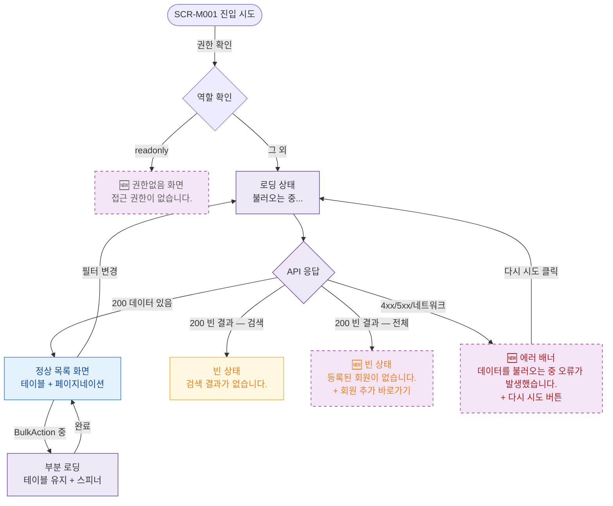

## 1. 목적

SCR-M001의 로딩/빈/에러/권한없음 등 UI 상태별 화면 분기를 명세한다. UI 상태 TC 원천.

## 2. 전제조건

- 사용자가 SCR-M001 진입을 시도한 상태이다.

## 3. 다이어그램

## 4. 엣지 설명 테이블

| 출발 | 도착 | 조건 | |---------|------|------|------| | | 진입 | 권한 확인 | 항상 | | | 권한 확인 | 권한없음 | readonly 역할 | | | 권한 확인 | 로딩 | primary | | | 로딩 | API 응답 | 호출 | | | API 응답 | 정상 목록 | 200, 데이터 존재 | | | API 응답 | 빈 상태(검색) | 200, 검색 필터 결과 0건 | | | API 응답 | 빈 상태(전체) | 200, 등록 회원 없음 | | | API 응답 | 에러 배너 | 4xx/5xx/네트워크 오류 | | | 에러 배너 | 로딩 | 다시 시도 클릭 | | | 정상 목록 | 로딩 | 필터/탭 변경 | | | 정상 목록 | 부분 로딩 | BulkAction 실행 중 | | | 부분 로딩 | 정상 목록 | 완료 후 refetch |
