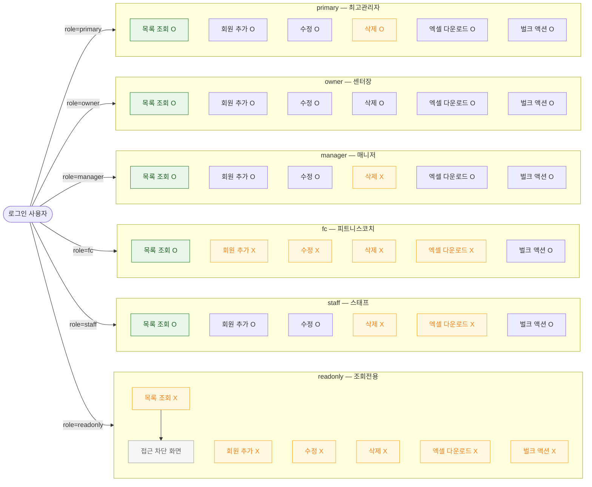

## 1. 목적

SCR-M001에서 6개 역할별 접근/액션 가능 범위를 명세한다. RBAC TC 원천.

## 2. 전제조건

- 로그인 완료, 세션 유효 상태이다.

## 3. 다이어그램

## 4. 엣지 설명 테이블

| 출발 | 도착 | 조건 | |---------|------|------|------| | | 로그인 사용자 | primary 블록 | role=primary | | | 로그인 사용자 | owner 블록 | role=owner | | | 로그인 사용자 | manager 블록 | role=manager | | | 로그인 사용자 | fc 블록 | role=fc | | | 로그인 사용자 | staff 블록 | role=staff | | | 로그인 사용자 | readonly 블록 | role=readonly | | | 조회 X | 접근 차단 | readonly는 화면 자체 접근 불가 |
