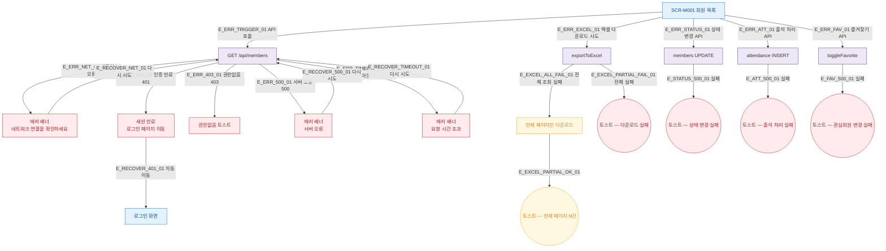

## 1. 목적

SCR-M001에서 발생 가능한 모든 에러/예외 케이스와 복구 경로를 명세한다. 네거티브 TC 원천.

## 2. 전제조건

- SCR-M001 진입 또는 조작 중 오류가 발생한 상태이다.

## 3. 다이어그램

## 4. 엣지 설명 테이블

| 엣지 ID | 출발 | 도착 | 조건 |
|---------|------|------|------|
| E_ERR_NET_01 | API | 네트워크 에러 | fetch 실패, 오프라인 |
| E_ERR_401_01 | API | 세션 만료 | 401 Unauthorized |
| E_ERR_403_01 | API | 권한없음 | 403 Forbidden |
| E_ERR_500_01 | API | 서버 오류 | 500 Internal Server Error |
| E_ERR_TIMEOUT_01 | API | 타임아웃 | 요청 시간 초과 |
| E_RECOVER_NET_01 | 네트워크 에러 | API 재호출 | 다시 시도 클릭 |
| E_RECOVER_500_01 | 서버 오류 | API 재호출 | 다시 시도 클릭 |
| E_RECOVER_TIMEOUT_01 | 타임아웃 | API 재호출 | 다시 시도 클릭 |
| E_RECOVER_401_01 | 세션 만료 | 로그인 | 자동 리다이렉트 |
| E_EXCEL_ALL_FAIL_01 | 엑셀 전체 조회 | 현재 페이지만 | 전체 조회 실패 시 폴백 |
| E_EXCEL_PARTIAL_FAIL_01 | 엑셀 전체 실패 | 실패 토스트 | 폴백도 실패 |
| E_STATUS_500_01 | 상태 변경 | 실패 토스트 | API 오류 |
| E_ATT_500_01 | 출석 처리 | 실패 토스트 | API 오류 |
| E_FAV_500_01 | 즐겨찾기 | 실패 토스트 | API 오류 |

## 5. TC 후보

| TC ID | 타입 | Given | When | Then |
|-------|------|-------|------|------|
| TC-M001-F8-01 | exception | 네트워크 오프라인 | SCR-M001 진입 | 에러 배너 표시, 다시 시도 가능 |
| TC-M001-F8-02 | exception | 세션 만료 | API 호출 | 로그인 화면 리다이렉트 |
| TC-M001-F8-03 | exception | 서버 500 | SCR-M001 진입 | 에러 배너 표시 |
| TC-M001-F8-04 | exception | 타임아웃 | API 호출 | 타임아웃 에러 배너 |
| TC-M001-F8-05 | exception | 에러 배너 표시 | 다시 시도 | API 재호출 |
| TC-M001-F8-06 | exception | 엑셀, 전체 조회 실패 | 엑셀 다운로드 | 현재 페이지 폴백 토스트 |
| TC-M001-F8-07 | exception | 상태 변경 API 500 | 변경 확인 | 실패 토스트, 모달 유지 |
| TC-M001-F8-08 | exception | 출석 처리 API 500 | 출석 처리 클릭 | 실패 토스트 |
| TC-M001-F8-09 | exception | 즐겨찾기 API 500 | ★ 클릭 | 실패 토스트 |
