## 1. 목적

SCR-M001에서 발생하는 모든 토스트 메시지(성공/경고/에러/정보)의 발생 조건을 명세한다. 피드백 TC 원천.

## 2. 전제조건

- SCR-M001 회원 목록이 표시된 상태이다.

## 3. 다이어그램

```mermaid
flowchart TD
  SCR_M001[SCR-M001 회원 목록]

  subgraph SUCCESS_TOASTS [success 토스트]
    T_FAV_ON((관심회원으로 등록되었습니다.))
    T_FAV_OFF((관심회원에서 해제되었습니다.))
    T_EXCEL_ALL((N건 엑셀 다운로드 완료 — 전체))
    T_EXCEL_PAGE((N건 엑셀 다운로드 완료 — 현재 페이지))
    T_STATUS_OK((N명의 상태를 변경했습니다.))
    T_ATT_OK((N명의 출석이 처리되었습니다.))
    T_FAV_BULK((N명을 관심회원으로 등록했습니다.))
  end

  subgraph WARNING_TOASTS [warning 토스트]
    T_NO_SELECT((회원을 먼저 선택해주세요.))
  end

  subgraph ERROR_TOASTS [error 토스트]
    T_FAV_ERR((관심회원 변경 실패))
    T_STATUS_ERR((상태 변경에 실패했습니다.))
    T_ATT_ERR((출석 처리에 실패했습니다.))
    T_EXCEL_ERR((엑셀 다운로드 실패))
  end

  subgraph INFO_TOASTS [info 토스트]
    T_FEATURE_NA((기능 준비 중입니다.))
  end

  SCR_M001 -->|E_TOAST_FAV_ON_01 isFavorite false → true 성공| T_FAV_ON
  SCR_M001 -->|E_TOAST_FAV_OFF_01 isFavorite true → false 성공| T_FAV_OFF
  SCR_M001 -->|E_TOAST_FAV_ERR_01 즐겨찾기 API 실패| T_FAV_ERR
  SCR_M001 -->|E_TOAST_EXCEL_ALL_01 엑셀 전체 다운로드 성공| T_EXCEL_ALL
  SCR_M001 -->|E_TOAST_EXCEL_PAGE_01 전체 조회 실패 후 현재 페이지| T_EXCEL_PAGE
  SCR_M001 -->|E_TOAST_EXCEL_ERR_01 엑셀 완전 실패| T_EXCEL_ERR
  SCR_M001 -->|E_TOAST_STATUS_OK_01 상태 변경 성공| T_STATUS_OK
  SCR_M001 -->|E_TOAST_STATUS_ERR_01 상태 변경 실패| T_STATUS_ERR
  SCR_M001 -->|E_TOAST_ATT_OK_01 출석 처리 성공| T_ATT_OK
  SCR_M001 -->|E_TOAST_ATT_ERR_01 출석 처리 실패| T_ATT_ERR
  SCR_M001 -->|E_TOAST_FAV_BULK_01 관심회원 일괄 등록 성공| T_FAV_BULK
  SCR_M001 -->|E_TOAST_NO_SEL_01 선택 없이 벌크 액션| T_NO_SELECT
  SCR_M001 -->|E_TOAST_FEATURE_NA_01 미구현 기능 클릭| T_FEATURE_NA

  classDef screen      fill:#E3F2FD,stroke:#1976D2,color:#0D47A1
  classDef modal       fill:#FFF3E0,stroke:#F57C00,color:#E65100
  classDef newFeature  fill:#F3E5F5,stroke:#9C27B0,stroke-dasharray:5 5
  classDef error       fill:#FFEBEE,stroke:#C62828,color:#B71C1C
  classDef success     fill:#E8F5E9,stroke:#2E7D32,color:#1B5E20
  classDef warning     fill:#FFF8E1,stroke:#F9A825,color:#F57F17
  classDef info        fill:#E0F7FA,stroke:#00838F
  classDef system      fill:#EDE7F6,stroke:#5E35B2
  classDef external    fill:#ECEFF1,stroke:#455A64,stroke-dasharray:3 3
  classDef cron        fill:#E0F2F1,stroke:#00695C
  classDef rbacBlocked fill:#F5F5F5,stroke:#9E9E9E,color:#616161

  class SCR_M001 screen
  class T_FAV_ON,T_FAV_OFF,T_EXCEL_ALL,T_EXCEL_PAGE,T_STATUS_OK,T_ATT_OK,T_FAV_BULK success
  class T_NO_SELECT warning
  class T_FAV_ERR,T_STATUS_ERR,T_ATT_ERR,T_EXCEL_ERR error
  class T_FEATURE_NA info
```

## 4. 엣지 설명 테이블

| 엣지 ID | 출발 | 도착 | 토스트 타입 | 메시지 |
|---------|------|------|-------------|--------|
| E_TOAST_FAV_ON_01 | SCR-M001 | 관심회원 등록 | success | "관심회원으로 등록되었습니다." |
| E_TOAST_FAV_OFF_01 | SCR-M001 | 관심회원 해제 | success | "관심회원에서 해제되었습니다." |
| E_TOAST_FAV_ERR_01 | SCR-M001 | 즐겨찾기 실패 | error | "관심회원 변경 실패" |
| E_TOAST_EXCEL_ALL_01 | SCR-M001 | 엑셀 전체 성공 | success | "${data.length}건 엑셀 다운로드 완료 (전체)" |
| E_TOAST_EXCEL_PAGE_01 | SCR-M001 | 엑셀 현재페이지 | success | "${data.length}건 엑셀 다운로드 완료 (현재 페이지)" |
| E_TOAST_EXCEL_ERR_01 | SCR-M001 | 엑셀 실패 | error | 다운로드 실패 메시지 |
| E_TOAST_STATUS_OK_01 | SCR-M001 | 상태 변경 성공 | success | "${ids.length}명의 상태를 '${label}'(으)로 변경했습니다." |
| E_TOAST_STATUS_ERR_01 | SCR-M001 | 상태 변경 실패 | error | "상태 변경에 실패했습니다." |
| E_TOAST_ATT_OK_01 | SCR-M001 | 출석 성공 | success | "${ids.length}명의 출석이 처리되었습니다." |
| E_TOAST_ATT_ERR_01 | SCR-M001 | 출석 실패 | error | "출석 처리에 실패했습니다." |
| E_TOAST_FAV_BULK_01 | SCR-M001 | 일괄 관심회원 | success | "${ids.length}명을 관심회원으로 등록했습니다." |
| E_TOAST_NO_SEL_01 | SCR-M001 | 선택 없음 경고 | warning | "회원을 먼저 선택해주세요." |
| E_TOAST_FEATURE_NA_01 | SCR-M001 | 미구현 안내 | info | "${type} 기능은 준비 중입니다." |

## 5. TC 후보

| TC ID | 타입 | Given | When | Then |
|-------|------|-------|------|------|
| TC-M001-F9-01 | positive | 미등록 즐겨찾기 | ★ 클릭 성공 | success 토스트 "관심회원 등록" |
| TC-M001-F9-02 | positive | 등록 즐겨찾기 | ★ 클릭 성공 | success 토스트 "관심회원 해제" |
| TC-M001-F9-03 | negative | 즐겨찾기 API 실패 | ★ 클릭 | error 토스트 "관심회원 변경 실패" |
| TC-M001-F9-04 | positive | 엑셀 전체 성공 | 엑셀 다운로드 | success 토스트 전체 건수 |
| TC-M001-F9-05 | positive | 엑셀 전체 실패 | 엑셀 다운로드 | success 토스트 현재 페이지 건수 |
| TC-M001-F9-06 | negative | 엑셀 완전 실패 | 엑셀 다운로드 | error 토스트 |
| TC-M001-F9-07 | positive | 3명 선택, 상태 변경 성공 | 변경 확인 | success "3명의 상태를 변경했습니다." |
| TC-M001-F9-08 | negative | 상태 변경 실패 | 변경 확인 | error "상태 변경에 실패했습니다." |
| TC-M001-F9-09 | positive | 2명 선택, 출석 성공 | 출석 처리 | success "2명의 출석이 처리되었습니다." |
| TC-M001-F9-10 | negative | 선택 없음 | 벌크 액션 버튼 | warning "회원을 먼저 선택해주세요." |
| TC-M001-F9-11 | positive | 미구현 기능 | 클릭 | info "기능 준비 중" 토스트 |
