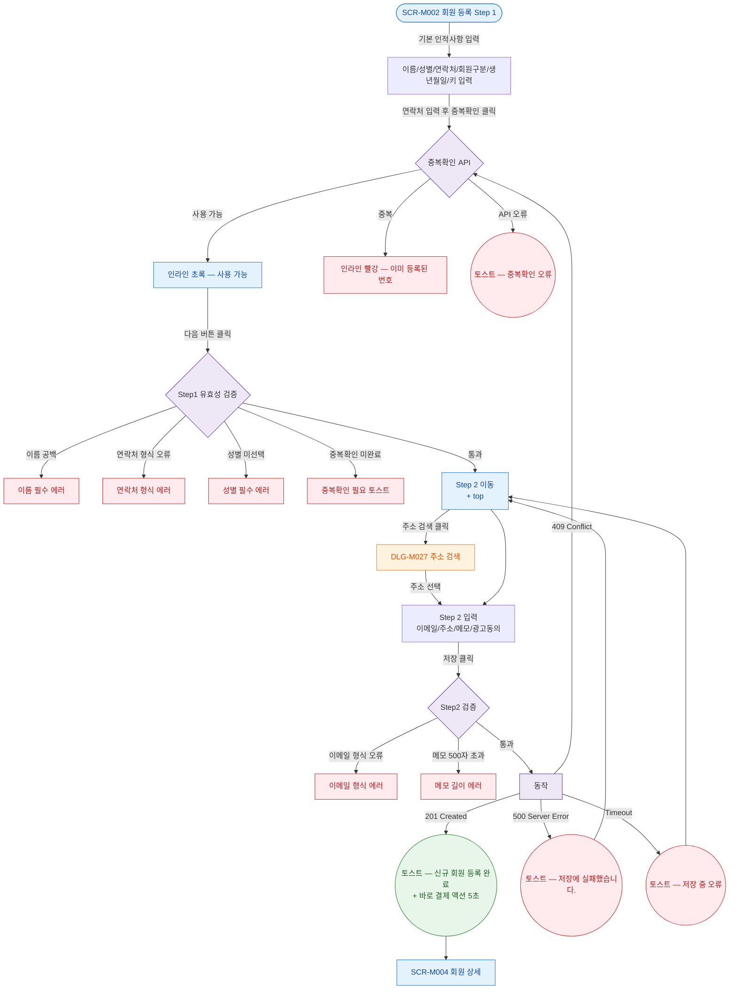

## 1. 목적

SCR-M002의 정상 시나리오(Happy Path)를 명세한다. 진입→Step1 입력→중복확인→Step2 입력→저장. 성공/검증실패/시스템에러 3갈래 분기 강제.

## 2. 전제조건

- primary 중 하나로 로그인되어 있다.
- SCR-M002 Step 1 화면이 표시된 상태이다.

## 3. 다이어그램

## 4. 엣지 설명 테이블

| 출발 | 도착 | 조건 | |---------|------|------|------| | | SCR-M002 | Step1 입력 | 필드 입력 | | | Step1 입력 | 중복확인 API | 중복확인 버튼 클릭 | | | 중복확인 | 사용 가능 | 중복 없음 | | | 중복확인 | 중복 | 동일 번호 존재 | | | 중복확인 | 오류 토스트 | API 실패 | | | 사용 가능 | Step1 검증 | 다음 버튼 클릭 | | | Step1 검증 | 이름 에러 | name 공백 | | | Step1 검증 | 연락처 에러 | phone 형식 불일치 | | | Step1 검증 | 성별 에러 | gender 미선택 | | | Step1 검증 | 중복확인 에러 | |
| Step1 검증 | Step2 | 모든 조건 통과 | | | Step2 | DLG-M027 | 주소 검색 버튼 클릭 | | | DLG-M027 | Step2 입력 | 주소 선택 후 자동 입력 | | | Step2 입력 | Step2 검증 | 저장 버튼 클릭 | | | Step2 검증 | 이메일 에러 | email 형식 오류 | | | Step2 검증 | 메모 에러 | notes자 | | | Step2 검증 | API | 검증 통과 | | | API | 성공 토스트 | 201 Created | | | 성공 토스트 | 회원 상세 | 자동 이동 | | | API | 중복확인 | 409 Conflict | | | API | 실패 토스트 | 500 | | | API | 타임아웃 토스트 | 타임아웃 |
