## 1. 목적

SCR-M002는 목록 필터가 없는 폼 화면이므로, F4는 폼 필드 입력/검증 흐름을 명세한다. 필드별 TC 원천.

## 2. 전제조건

- SCR-M002 폼이 표시된 상태이다.

## 3. 다이어그램

```mermaid
flowchart TD
  FORM[SCR-M002 폼]

  subgraph STEP1_FIELDS [Step 1 필수 필드]
    F_NAME[이름\n한글/영문/한자 2~20자\n필수]
    F_GENDER[성별\n남성/여성 토글\n필수]
    F_PHONE[연락처\n010-xxxx-xxxx\n필수]
    F_MEMTYPE[회원구분\n일반/기명법인/무기명법인\n필수]
    F_BIRTH[생년월일\n미래 날짜 불가\n선택]
    F_HEIGHT[키 cm\n100~250\n선택]
    F_CORP[법인 회사명\n법인 선택 시 표시]
    F_FC[담당 FC\n선택]
    F_TRAINER[담당 트레이너\n선택]
    F_VISIT[방문 경로\n선택]
    F_INFLOW[유입경로\n선택]
    F_GOAL[운동 목적\n선택]
  end

  subgraph STEP2_FIELDS [Step 2 추가 필드]
    F_NICK[별칭/닉네임\n선택]
    F_EMAIL[이메일\n형식 검증\n선택]
    F_ADDR[주소\n5자 이상\n선택]
    F_ADDR_DETAIL[상세 주소\n선택]
    F_COMPANY[회사명\n선택]
    F_ATT_NUM[출석번호\n선택]
    F_MKTG[광고성 정보 수신 동의\ncheckbox]
    F_MEMO[메모\ntextarea 500자]
  end

  FORM --> STEP1_FIELDS
  FORM --> STEP2_FIELDS

  F_NAME -->|2~20자|VALID_NAME[유효]
  F_NAME -->|공백/형식|ERR_NAME[이름 에러\n한글/영문/한자 2~20자]

  F_GENDER -->|선택|VALID_GENDER[유효]
  F_GENDER -->|미선택|ERR_GENDER[성별 필수 에러]

  F_PHONE -->|입력|PHONE_FORMAT[자동 변환]
  PHONE_FORMAT -->|010-xxxx-xxxx|VALID_PHONE[유효]
  PHONE_FORMAT -->|형식 불일치|ERR_PHONE[연락처 형식 에러]

  F_MEMTYPE -->|기명/무기명 선택|SHOW_CORP[법인 회사명 필드 표시]
  F_MEMTYPE -->|일반 선택|HIDE_CORP[법인 회사명 필드 숨김]

  F_BIRTH -->|미래 날짜|ERR_BIRTH[올바른 날짜 에러]
  F_BIRTH -->|과거/현재|VALID_BIRTH[유효]

  F_HEIGHT -->|범위 벗어남|ERR_HEIGHT[100~250cm 에러]
  F_HEIGHT -->|100~250|VALID_HEIGHT[유효]

  F_EMAIL -->|형식 맞음 또는 공백|VALID_EMAIL[유효]
  F_EMAIL -->|형식 틀림|ERR_EMAIL[이메일 형식 에러]

  F_MEMO -->|500자 이하|VALID_MEMO[유효]
  F_MEMO -->|500자 초과|ERR_MEMO[500자 초과 에러\n카운터 표시]

  classDef screen fill:#E3F2FD,stroke:#1976D2,color:#0D47A1
  classDef modal fill:#FFF3E0,stroke:#F57C00,color:#E65100
  classDef newFeature fill:#F3E5F5,stroke:#9C27B0,stroke-dasharray:5 5
  classDef error fill:#FFEBEE,stroke:#C62828,color:#B71C1C
  classDef success fill:#E8F5E9,stroke:#2E7D32,color:#1B5E20
  classDef warning fill:#FFF8E1,stroke:#F9A825,color:#F57F17
  classDef info fill:#E0F7FA,stroke:#00838F
  classDef system fill:#EDE7F6,stroke:#5E35B2
  classDef external fill:#ECEFF1,stroke:#455A64,stroke-dasharray:3 3
  classDef cron fill:#E0F2F1,stroke:#00695C
  classDef rbacBlocked fill:#F5F5F5,stroke:#9E9E9E,color:#616161

  class FORM screen
  class PHONE_FORMAT,SHOW_CORP,HIDE_CORP system
  class ERR_NAME,ERR_GENDER,ERR_PHONE,ERR_BIRTH,ERR_HEIGHT,ERR_EMAIL,ERR_MEMO error
  class VALID_NAME,VALID_GENDER,VALID_PHONE,VALID_BIRTH,VALID_HEIGHT,VALID_EMAIL,VALID_MEMO success
```

## 4. 엣지 설명 테이블

| 출발 | 도착 | 조건 | |---------|------|------|------| | | 이름 | 유효 | regex 통과 | | | 이름 | 에러 | 공백 또는 형식 불일치 | | | 연락처 | | 입력 시 자동 변환 | | | | 유효 | 010-xxxx-xxxx | | | | 에러 | 형식 불일치 | | | 회원구분 | 법인 필드 표시 | 기명/무기명 선택 | | | 회원구분 | 법인 필드 숨김 | 일반 선택 | | | 생년월일 | 에러 | 미래 날짜 | | | 키 | 에러 | 100 미만 또는 250 초과 | | | 이메일 | 에러 | 형식 불일치 (비어 있으면 유효) | | | 메모 | 에러 | 500자 초과 |
