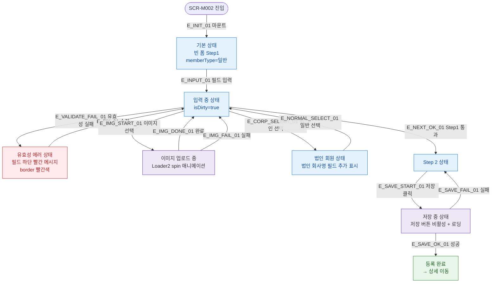

## 1. 목적

SCR-M002의 UI 상태(기본/유효성에러/이미지업로드중/저장중/법인선택) 분기를 명세한다.

## 2. 전제조건

- SCR-M002가 진입된 상태이다.

## 3. 다이어그램

## 4. 엣지 설명 테이블

| 엣지 ID | 출발 | 도착 | 조건 |
|---------|------|------|------|
| E_INIT_01 | 진입 | 기본 상태 | 마운트 시 Step1 빈 폼 |
| E_INPUT_01 | 기본 | 입력 중 | 필드 입력 시작, isDirty=true |
| E_VALIDATE_FAIL_01 | 입력 중 | 에러 상태 | 유효성 검증 실패 |
| E_FIX_01 | 에러 | 입력 중 | 필드 수정 |
| E_IMG_START_01 | 입력 중 | 이미지 로딩 | 파일 선택 후 업로드 시작 |
| E_IMG_DONE_01 | 이미지 로딩 | 입력 중 | 업로드 완료 |
| E_IMG_FAIL_01 | 이미지 로딩 | 입력 중 | 업로드 실패 |
| E_CORP_SELECT_01 | 입력 중 | 법인 상태 | memberType=기명/무기명 선택 |
| E_NORMAL_SELECT_01 | 법인 상태 | 입력 중 | memberType=일반 선택 |
| E_NEXT_OK_01 | 입력 중 | Step 2 | Step1 검증 통과 |
| E_SAVE_START_01 | Step 2 | 저장 중 | 저장 버튼 클릭, isSubmitting=true |
| E_SAVE_OK_01 | 저장 중 | 완료 | API 성공 |
| E_SAVE_FAIL_01 | 저장 중 | Step 2 | API 실패, 폼 유지 |

## 5. TC 후보

| TC ID | 타입 | Given | When | Then |
|-------|------|-------|------|------|
| TC-M002-F6-01 | positive | 진입 | 마운트 | Step1 빈 폼, memberType=일반 |
| TC-M002-F6-02 | negative | 필드 유효성 실패 | 다음 클릭 | 에러 메시지 표시, border 빨간색 |
| TC-M002-F6-03 | positive | 이미지 업로드 중 | 파일 선택 | Loader2 스피너 표시 |
| TC-M002-F6-04 | positive | 기명법인 선택 | 회원구분 변경 | 법인 회사명 필드 표시 |
| TC-M002-F6-05 | positive | 일반 선택 | 회원구분 변경 | 법인 회사명 필드 숨김 |
| TC-M002-F6-06 | positive | 저장 중 | 저장 클릭 | 버튼 비활성, 스피너 표시 |
| TC-M002-F6-07 | positive | 저장 성공 | API 200 | 완료 상태, 상세 이동 |
| TC-M002-F6-08 | negative | 저장 실패 | API 500 | Step2 유지, 실패 토스트 |
