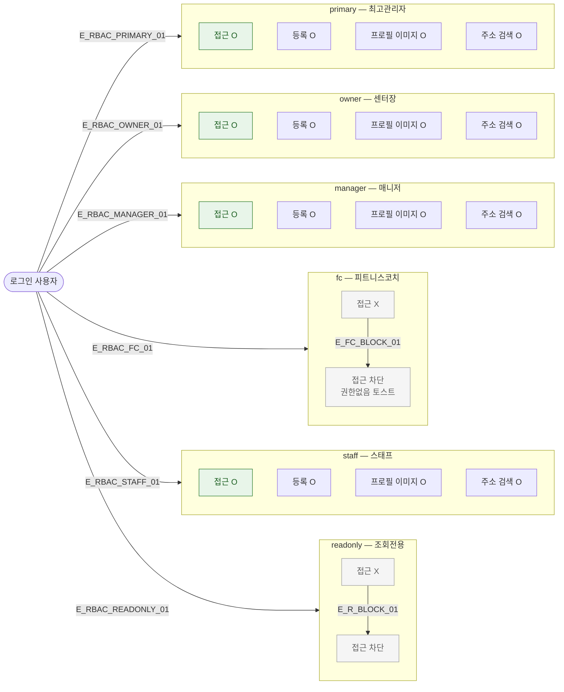

## 1. 목적

SCR-M002에서 6개 역할별 접근/액션 가능 범위를 명세한다. RBAC TC 원천.

## 2. 전제조건

- 로그인 완료, 세션 유효 상태이다.

## 3. 다이어그램

## 4. 엣지 설명 테이블

| 엣지 ID | 출발 | 도착 | 조건 |
|---------|------|------|------|
| E_RBAC_PRIMARY_01 | 사용자 | primary | role=primary |
| E_RBAC_OWNER_01 | 사용자 | owner | role=owner |
| E_RBAC_MANAGER_01 | 사용자 | manager | role=manager |
| E_RBAC_FC_01 | 사용자 | fc | role=fc |
| E_RBAC_STAFF_01 | 사용자 | staff | role=staff |
| E_RBAC_READONLY_01 | 사용자 | readonly | role=readonly |
| E_FC_BLOCK_01 | fc 접근 X | 차단 | fc는 등록 불가 |
| E_R_BLOCK_01 | readonly 접근 X | 차단 | readonly는 전체 접근 불가 |

## 5. TC 후보

| TC ID | 타입 | Given | When | Then |
|-------|------|-------|------|------|
| TC-M002-F7-01 | positive | primary | /members/new 접근 | Step1 폼 표시 |
| TC-M002-F7-02 | positive | owner | /members/new 접근 | Step1 폼 표시 |
| TC-M002-F7-03 | positive | manager | /members/new 접근 | Step1 폼 표시 |
| TC-M002-F7-04 | negative | fc | /members/new 접근 | 접근 차단 |
| TC-M002-F7-05 | positive | staff | /members/new 접근 | Step1 폼 표시 |
| TC-M002-F7-06 | negative | readonly | /members/new 접근 | 접근 차단 |
