## 1. 목적

SCR-M002에서 발생 가능한 모든 에러/예외 케이스와 복구 경로를 명세한다.

## 2. 전제조건

- SCR-M002 폼 입력 또는 저장 중 오류 발생 상태이다.

## 3. 다이어그램

```mermaid
flowchart TD
  SCR_M002[SCR-M002 회원 등록]

  subgraph VALIDATION_ERRORS [유효성 검증 에러]
    ERR_NAME[이름 공백 또는 형식 불일치\n한글/영문/한자 2~20자]
    ERR_GENDER[성별 미선택]
    ERR_PHONE[연락처 형식 불일치\n010-xxxx-xxxx]
    ERR_MEMTYPE[회원구분 미선택]
    ERR_BIRTH[생년월일 미래 날짜]
    ERR_HEIGHT[키 범위 벗어남\n100~250cm]
    ERR_EMAIL[이메일 형식 불일치]
    ERR_MEMO[메모 500자 초과]
    ERR_DUP_CHECK[중복확인 미완료\]
  end

  subgraph API_ERRORS [API 에러]
    ERR_DUP_PHONE[전화번호 중복\n이미 등록된 번호]
    ERR_DUP_API[중복확인 API 오류]
    ERR_SAVE_409[저장 409 Conflict]
    ERR_SAVE_500[저장 500 오류]
    ERR_SAVE_TIMEOUT[저장 타임아웃]
    ERR_IMG_TYPE[이미지 타입 오류\nimage/* 아님]
    ERR_IMG_SIZE[이미지 크기 초과\n5MB 이상]
    ERR_IMG_API[이미지 업로드 API 실패]
    ERR_401[세션 만료 401]
  end

  SCR_M002 -->|다음/저장 클릭 시|VALIDATION_ERRORS
  SCR_M002 -->|API 호출 시|API_ERRORS

  ERR_NAME -->|수정|SCR_M002
  ERR_GENDER -->|선택|SCR_M002
  ERR_PHONE -->|수정|SCR_M002
  ERR_DUP_CHECK -->|중복확인 클릭|SCR_M002

  ERR_DUP_PHONE -->|다른 번호 입력|SCR_M002
  ERR_SAVE_409 -->|중복확인 재실행|SCR_M002
  ERR_SAVE_500 -->|폼 유지 재시도|SCR_M002
  ERR_SAVE_TIMEOUT -->|재시도|SCR_M002
  ERR_401 -->|자동 이동|LOGIN[로그인 화면]

  classDef screen fill:#E3F2FD,stroke:#1976D2,color:#0D47A1
  classDef modal fill:#FFF3E0,stroke:#F57C00,color:#E65100
  classDef newFeature fill:#F3E5F5,stroke:#9C27B0,stroke-dasharray:5 5
  classDef error fill:#FFEBEE,stroke:#C62828,color:#B71C1C
  classDef success fill:#E8F5E9,stroke:#2E7D32,color:#1B5E20
  classDef warning fill:#FFF8E1,stroke:#F9A825,color:#F57F17
  classDef info fill:#E0F7FA,stroke:#00838F
  classDef system fill:#EDE7F6,stroke:#5E35B2
  classDef external fill:#ECEFF1,stroke:#455A64,stroke-dasharray:3 3
  classDef cron fill:#E0F2F1,stroke:#00695C
  classDef rbacBlocked fill:#F5F5F5,stroke:#9E9E9E,color:#616161

  class SCR_M002,LOGIN screen
  class ERR_NAME,ERR_GENDER,ERR_PHONE,ERR_MEMTYPE,ERR_BIRTH,ERR_HEIGHT,ERR_EMAIL,ERR_MEMO,ERR_DUP_CHECK,ERR_DUP_PHONE,ERR_DUP_API,ERR_SAVE_409,ERR_SAVE_500,ERR_SAVE_TIMEOUT,ERR_IMG_TYPE,ERR_IMG_SIZE,ERR_IMG_API,ERR_401 error
```

## 4. 엣지 설명 테이블

| 출발 | 도착 | 에러 메시지 | |---------|------|------|-------------| | | SCR-M002 | 유효성 에러 | 다음/저장 클릭 시 react-hook-form trigger | | | SCR-M002 | API 에러 | 각 API 호출 시 | | | 중복 번호 | SCR-M002 | 다른 번호 입력 후 재확인 | | | 409 Conflict | SCR-M002 | 중복확인 재실행 | | | 500 오류 | SCR-M002 | 폼 유지, 재시도 가능 | | | 타임아웃 | SCR-M002 | 재시도 | | | 401 | 로그인 | 세션 만료 자동 리다이렉트 |
