## 1. 목적

SCR-M002에서 발생 가능한 모든 에러/예외 케이스와 복구 경로를 명세한다.

## 2. 전제조건

- SCR-M002 폼 입력 또는 저장 중 오류 발생 상태이다.

## 3. 다이어그램

```mermaid
flowchart TD
  SCR_M002[SCR-M002 회원 등록]

  subgraph VALIDATION_ERRORS [유효성 검증 에러]
    ERR_NAME[이름 공백 또는 형식 불일치\n한글/영문/한자 2~20자]
    ERR_GENDER[성별 미선택]
    ERR_PHONE[연락처 형식 불일치\n010-xxxx-xxxx]
    ERR_MEMTYPE[회원구분 미선택]
    ERR_BIRTH[생년월일 미래 날짜]
    ERR_HEIGHT[키 범위 벗어남\n100~250cm]
    ERR_EMAIL[이메일 형식 불일치]
    ERR_MEMO[메모 500자 초과]
    ERR_DUP_CHECK[중복확인 미완료\nphoneChecked=false]
  end

  subgraph API_ERRORS [API 에러]
    ERR_DUP_PHONE[전화번호 중복\n이미 등록된 번호]
    ERR_DUP_API[중복확인 API 오류]
    ERR_SAVE_409[저장 409 Conflict]
    ERR_SAVE_500[저장 500 오류]
    ERR_SAVE_TIMEOUT[저장 타임아웃]
    ERR_IMG_TYPE[이미지 타입 오류\nimage/* 아님]
    ERR_IMG_SIZE[이미지 크기 초과\n5MB 이상]
    ERR_IMG_API[이미지 업로드 API 실패]
    ERR_401[세션 만료 401]
  end

  SCR_M002 -->|E_ERR_VALID_01 다음/저장 클릭 시| VALIDATION_ERRORS
  SCR_M002 -->|E_ERR_API_01 API 호출 시| API_ERRORS

  ERR_NAME    -->|E_FIX_NAME_01 수정| SCR_M002
  ERR_GENDER  -->|E_FIX_GENDER_01 선택| SCR_M002
  ERR_PHONE   -->|E_FIX_PHONE_01 수정| SCR_M002
  ERR_DUP_CHECK -->|E_FIX_DUP_01 중복확인 클릭| SCR_M002

  ERR_DUP_PHONE -->|E_DUP_PHONE_FIX_01 다른 번호 입력| SCR_M002
  ERR_SAVE_409  -->|E_SAVE_409_FIX_01 중복확인 재실행| SCR_M002
  ERR_SAVE_500  -->|E_SAVE_500_FIX_01 폼 유지 재시도| SCR_M002
  ERR_SAVE_TIMEOUT -->|E_TIMEOUT_FIX_01 재시도| SCR_M002
  ERR_401       -->|E_AUTH_401_01 자동 이동| LOGIN[로그인 화면]

  classDef screen      fill:#E3F2FD,stroke:#1976D2,color:#0D47A1
  classDef modal       fill:#FFF3E0,stroke:#F57C00,color:#E65100
  classDef newFeature  fill:#F3E5F5,stroke:#9C27B0,stroke-dasharray:5 5
  classDef error       fill:#FFEBEE,stroke:#C62828,color:#B71C1C
  classDef success     fill:#E8F5E9,stroke:#2E7D32,color:#1B5E20
  classDef warning     fill:#FFF8E1,stroke:#F9A825,color:#F57F17
  classDef info        fill:#E0F7FA,stroke:#00838F
  classDef system      fill:#EDE7F6,stroke:#5E35B2
  classDef external    fill:#ECEFF1,stroke:#455A64,stroke-dasharray:3 3
  classDef cron        fill:#E0F2F1,stroke:#00695C
  classDef rbacBlocked fill:#F5F5F5,stroke:#9E9E9E,color:#616161

  class SCR_M002,LOGIN screen
  class ERR_NAME,ERR_GENDER,ERR_PHONE,ERR_MEMTYPE,ERR_BIRTH,ERR_HEIGHT,ERR_EMAIL,ERR_MEMO,ERR_DUP_CHECK,ERR_DUP_PHONE,ERR_DUP_API,ERR_SAVE_409,ERR_SAVE_500,ERR_SAVE_TIMEOUT,ERR_IMG_TYPE,ERR_IMG_SIZE,ERR_IMG_API,ERR_401 error
```

## 4. 엣지 설명 테이블

| 엣지 ID | 출발 | 도착 | 에러 메시지 |
|---------|------|------|-------------|
| E_ERR_VALID_01 | SCR-M002 | 유효성 에러 | 다음/저장 클릭 시 react-hook-form trigger |
| E_ERR_API_01 | SCR-M002 | API 에러 | 각 API 호출 시 |
| E_DUP_PHONE_FIX_01 | 중복 번호 | SCR-M002 | 다른 번호 입력 후 재확인 |
| E_SAVE_409_FIX_01 | 409 Conflict | SCR-M002 | 중복확인 재실행 |
| E_SAVE_500_FIX_01 | 500 오류 | SCR-M002 | 폼 유지, 재시도 가능 |
| E_TIMEOUT_FIX_01 | 타임아웃 | SCR-M002 | 재시도 |
| E_AUTH_401_01 | 401 | 로그인 | 세션 만료 자동 리다이렉트 |

## 5. TC 후보

| TC ID | 타입 | Given | When | Then |
|-------|------|-------|------|------|
| TC-M002-F8-01 | negative | 이름 공백 | 다음 클릭 | 이름 필수 에러 표시 |
| TC-M002-F8-02 | negative | 성별 미선택 | 다음 클릭 | 성별 필수 에러 |
| TC-M002-F8-03 | negative | 연락처 형식 불일치 | 다음 클릭 | 연락처 형식 에러 |
| TC-M002-F8-04 | negative | 중복확인 미완료 | 다음 클릭 | 중복확인 필요 토스트 |
| TC-M002-F8-05 | negative | 중복 번호 | 중복확인 | 빨강 인라인 에러 |
| TC-M002-F8-06 | negative | 이메일 형식 오류 | 저장 클릭 | 이메일 에러 |
| TC-M002-F8-07 | negative | 메모 501자 | 저장 클릭 | 메모 길이 에러 |
| TC-M002-F8-08 | exception | 저장 API 500 | 저장 클릭 | 실패 토스트, 폼 유지 |
| TC-M002-F8-09 | exception | 저장 API 409 | 저장 클릭 | 중복 토스트 |
| TC-M002-F8-10 | exception | 저장 타임아웃 | 저장 클릭 | 타임아웃 토스트, 폼 유지 |
| TC-M002-F8-11 | exception | 이미지 타입 오류 | 파일 선택 | 타입 에러 토스트 |
| TC-M002-F8-12 | exception | 이미지 5MB 초과 | 파일 선택 | 크기 에러 토스트 |
| TC-M002-F8-13 | exception | 세션 만료 중 저장 | 저장 클릭 | 로그인 리다이렉트 |
