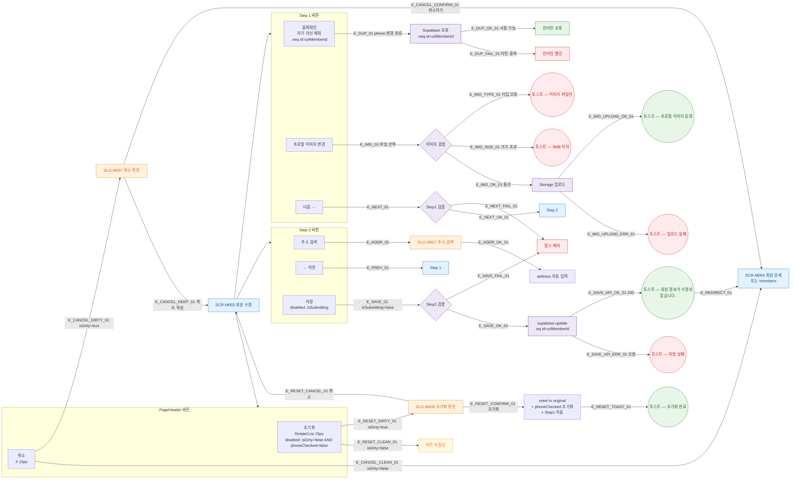

## 1. 목적

SCR-M003에 존재하는 모든 버튼/액션을 노드로 표현하고 각각의 동작 흐름을 명세한다. SCR-M002와 동일 컴포넌트, isEditRoute 플래그 분기.

## 2. 전제조건

- SCR-M003 회원 수정 화면이 기존 데이터 pre-fill 완료 상태이다.

## 3. 다이어그램

## 4. 엣지 설명 테이블

| 엣지 ID | 출발 | 도착 | 조건 |
|---------|------|------|------|
| E_RESET_DIRTY_01 | 초기화 | DLG-M008 | isDirty=true |
| E_RESET_CONFIRM_01 | DLG-M008 | 원본 복원 | 기존 데이터로 reset (등록과 달리 원본값) |
| E_CANCEL_DIRTY_01 | 취소 | DLG-M007 | isDirty=true |
| E_CANCEL_CLEAN_01 | 취소 | 상세 이동 | isDirty=false |
| E_DUP_01 | 중복확인 | API | phone 변경 후, .neq(urlMemberId) |
| E_SAVE_API_OK_01 | API | 성공 토스트 | supabase.update 성공 |
| E_REDIRECT_01 | 성공 토스트 | 상세 이동 | 자동 이동 |

## 5. TC 후보

| TC ID | 타입 | Given | When | Then |
|-------|------|-------|------|------|
| TC-M003-F3-01 | positive | isDirty=true | 초기화 클릭 | DLG-M008 열림 |
| TC-M003-F3-02 | positive | DLG-M008 | 초기화 확인 | 원본 데이터 복원, Step1 이동 |
| TC-M003-F3-03 | positive | isDirty=false | 취소 클릭 | 바로 상세 이동 |
| TC-M003-F3-04 | positive | isDirty=true | 취소 클릭 | DLG-M007 열림 |
| TC-M003-F3-05 | positive | 연락처 변경 | 중복확인 | 자기 자신 제외 중복 검사 |
| TC-M003-F3-06 | negative | 타인과 중복 번호 | 중복확인 | 빨강 인라인 |
| TC-M003-F3-07 | positive | Step2 | 저장 클릭 | API update, 성공 토스트, 상세 이동 |
| TC-M003-F3-08 | exception | API 500 | 저장 클릭 | 실패 토스트, 폼 유지 |
