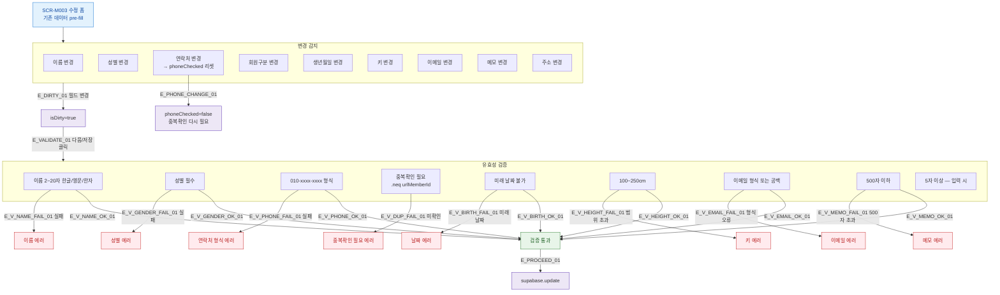

## 1. 목적

SCR-M003은 목록 필터가 없는 폼 화면이므로, F4는 수정 폼 필드 입력/검증 흐름을 명세한다. SCR-M002와 동일 필드 구조이나 isEditRoute=true 분기가 적용된다.

## 2. 전제조건

- SCR-M003이 기존 데이터 pre-fill 완료 상태이다.

## 3. 다이어그램

## 4. 엣지 설명 테이블

| 엣지 ID | 출발 | 도착 | 조건 |
|---------|------|------|------|
| E_DIRTY_01 | 필드 변경 | isDirty=true | 원본값과 다른 값 입력 |
| E_PHONE_CHANGE_01 | 연락처 변경 | phoneChecked 리셋 | 연락처 수정 시 재확인 필요 |
| E_VALIDATE_01 | isDirty | 검증 | 다음/저장 클릭 |
| E_V_NAME_FAIL_01 | 이름 검증 | 에러 | 형식 불일치 |
| E_V_PHONE_FAIL_01 | 연락처 검증 | 에러 | 010-xxxx-xxxx 불일치 |
| E_V_DUP_FAIL_01 | 중복확인 검증 | 에러 | phoneChecked=false |
| E_PROCEED_01 | 검증 통과 | API update | supabase.update.eq(id) |

## 5. TC 후보

| TC ID | 타입 | Given | When | Then |
|-------|------|-------|------|------|
| TC-M003-F4-01 | positive | pre-fill 완료 | 이름 수정 | isDirty=true |
| TC-M003-F4-02 | negative | 이름 공백으로 변경 | 다음 클릭 | 이름 에러 |
| TC-M003-F4-03 | positive | 연락처 변경 | 입력 | phoneChecked=false 리셋 |
| TC-M003-F4-04 | negative | 연락처 변경, 중복확인 미완료 | 다음 클릭 | 중복확인 필요 에러 |
| TC-M003-F4-05 | positive | 연락처 변경, 중복확인 | 자기 id 제외 확인 | 정상 통과 |
| TC-M003-F4-06 | negative | 생년월일 미래 날짜 | 입력 | 날짜 에러 |
| TC-M003-F4-07 | negative | 이메일 형식 오류 | 저장 클릭 | 이메일 에러 |
| TC-M003-F4-08 | negative | 메모 501자 | 저장 클릭 | 500자 에러 |
