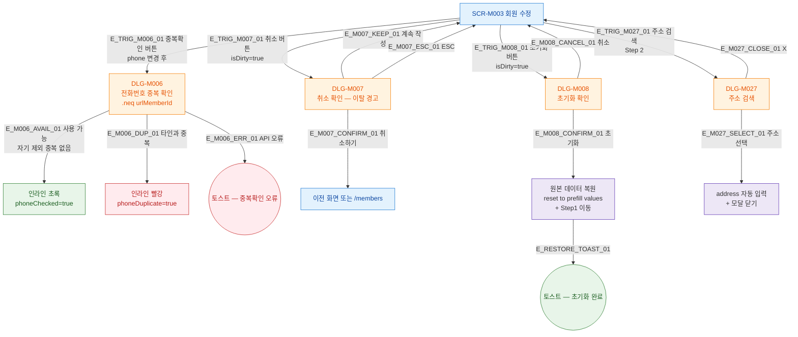

## 1. 목적

SCR-M003에서 트리거되는 모든 모달/다이얼로그의 진입 경로 트리를 명세한다.

## 2. 전제조건

- SCR-M003 회원 수정 화면이 표시된 상태이다.

## 3. 다이어그램

## 4. 엣지 설명 테이블

| 엣지 ID | 출발 | 도착 | 조건 |
|---------|------|------|------|
| E_TRIG_M006_01 | SCR-M003 | DLG-M006 | 연락처 변경 후 중복확인 클릭 |
| E_TRIG_M007_01 | SCR-M003 | DLG-M007 | 취소, isDirty=true (이탈 경고) |
| E_TRIG_M008_01 | SCR-M003 | DLG-M008 | 초기화 버튼 |
| E_TRIG_M027_01 | SCR-M003 | DLG-M027 | 주소 검색, Step 2 |
| E_M006_AVAIL_01 | DLG-M006 | 사용 가능 | .neq(urlMemberId) 결과 없음 |
| E_M006_DUP_01 | DLG-M006 | 중복 | 타인 번호 중복 |
| E_M007_CONFIRM_01 | DLG-M007 | 이전 화면 | 취소하기 |
| E_M007_KEEP_01 | DLG-M007 | SCR-M003 | 계속 작성 |
| E_M008_CONFIRM_01 | DLG-M008 | 원본 복원 | 기존 데이터로 reset (등록과 차이) |
| E_M027_SELECT_01 | DLG-M027 | 주소 자동 입력 | 주소 선택 |

## 5. TC 후보

| TC ID | 타입 | Given | When | Then |
|-------|------|-------|------|------|
| TC-M003-F5-01 | positive | 연락처 변경 | 중복확인 클릭 | 자기 id 제외 조회 |
| TC-M003-F5-02 | positive | 자기 번호 그대로 | 중복확인 | 사용 가능 (자기 제외) |
| TC-M003-F5-03 | negative | 타인과 동일 번호 변경 | 중복확인 | 빨강 인라인 |
| TC-M003-F5-04 | positive | isDirty=true | 취소 클릭 | DLG-M007 열림 |
| TC-M003-F5-05 | positive | DLG-M007 | 취소하기 | 이전 화면 이동 |
| TC-M003-F5-06 | positive | DLG-M007 | 계속 작성 | 폼 유지 |
| TC-M003-F5-07 | positive | isDirty=true | 초기화 클릭 | DLG-M008 열림 |
| TC-M003-F5-08 | positive | DLG-M008 | 초기화 확인 | 원본 데이터 복원, Step1 |
| TC-M003-F5-09 | positive | Step2 | 주소 검색 | DLG-M027 열림 |
| TC-M003-F5-10 | positive | DLG-M027 | 주소 선택 | 자동 입력, 모달 닫힘 |
