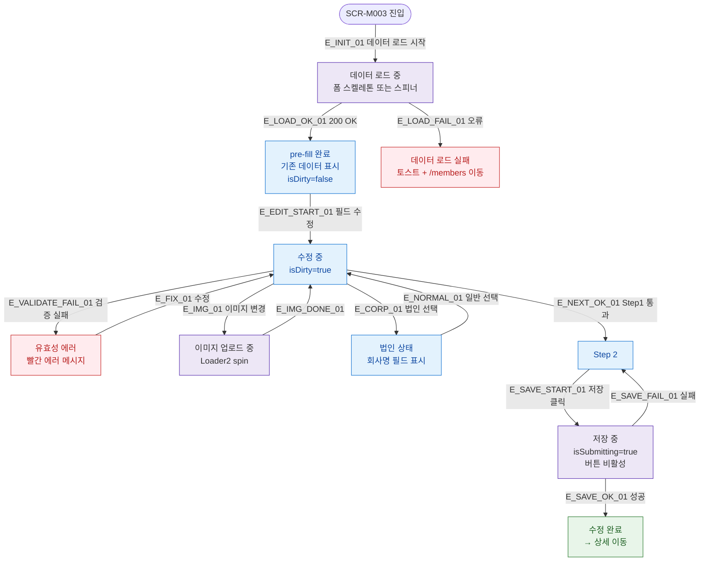

## 1. 목적

SCR-M003의 UI 상태(데이터 로드중/pre-fill완료/수정중/저장중/에러) 분기를 명세한다.

## 2. 전제조건

- SCR-M003 진입이 시도된 상태이다.

## 3. 다이어그램

## 4. 엣지 설명 테이블

| 엣지 ID | 출발 | 도착 | 조건 |
|---------|------|------|------|
| E_INIT_01 | 진입 | 스켈레톤 | GET /api/members/{id} 시작 |
| E_LOAD_OK_01 | 스켈레톤 | pre-fill | 200 OK |
| E_LOAD_FAIL_01 | 스켈레톤 | 로드 실패 | 오류, /members 이동 |
| E_EDIT_START_01 | pre-fill | 수정 중 | 필드 변경, isDirty=true |
| E_VALIDATE_FAIL_01 | 수정 중 | 에러 | 검증 실패 |
| E_IMG_01 | 수정 중 | 이미지 로딩 | 파일 선택 |
| E_CORP_01 | 수정 중 | 법인 상태 | memberType 변경 |
| E_NEXT_OK_01 | 수정 중 | Step2 | Step1 통과 |
| E_SAVE_START_01 | Step2 | 저장 중 | 저장 클릭 |
| E_SAVE_OK_01 | 저장 중 | 완료 | API 성공 |
| E_SAVE_FAIL_01 | 저장 중 | Step2 | API 실패 |

## 5. TC 후보

| TC ID | 타입 | Given | When | Then |
|-------|------|-------|------|------|
| TC-M003-F6-01 | positive | 진입 | 마운트 | 스켈레톤 표시 후 pre-fill 완료 |
| TC-M003-F6-02 | exception | 잘못된 id | 마운트 | 에러 토스트 + /members 이동 |
| TC-M003-F6-03 | positive | pre-fill | 필드 수정 | isDirty=true |
| TC-M003-F6-04 | negative | 검증 실패 | 다음 클릭 | 에러 메시지 표시 |
| TC-M003-F6-05 | positive | 이미지 변경 | 파일 선택 | 스피너 표시 |
| TC-M003-F6-06 | positive | 저장 클릭 | isSubmitting | 버튼 비활성, 스피너 |
| TC-M003-F6-07 | positive | 저장 성공 | API 200 | 완료, 상세 이동 |
| TC-M003-F6-08 | negative | 저장 실패 | API 500 | Step2 유지, 실패 토스트 |
