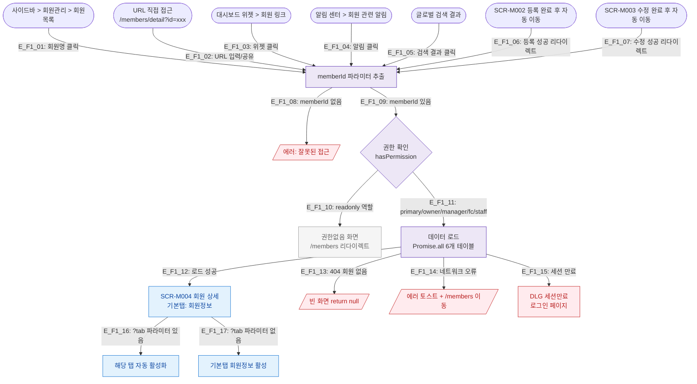

## 1. 목적

SCR-M004 회원 상세 화면에 진입 가능한 모든 경로를 정의한다. 진입 시 memberId 파라미터 유효성 검증 및 권한 확인 분기를 포함한다.

## 2. 전제조건

- 로그인 세션 유효
- memberId 파라미터 존재

## 3. 다이어그램

## 4. 엣지 설명

| 엣지 ID | 출발 | 도착 | 조건/액션 |
|---------|------|------|-----------|
| E_F1_01 | SCR-M001 회원목록 | ROUTE | 회원명(ghost 버튼) 클릭 |
| E_F1_02 | URL 직접 | ROUTE | /members/detail?id={memberId} |
| E_F1_03 | 대시보드 | ROUTE | 위젯 내 회원 링크 클릭 |
| E_F1_04 | 알림 센터 | ROUTE | 회원 관련 알림 딥링크 |
| E_F1_05 | 글로벌 검색 | ROUTE | 검색 결과 회원 항목 클릭 |
| E_F1_06 | SCR-M002 | ROUTE | 등록 완료 후 자동 리다이렉트 |
| E_F1_07 | SCR-M003 | ROUTE | 수정 완료 후 자동 리다이렉트 |
| E_F1_08 | ROUTE | ERR_NOID | memberId 쿼리 파라미터 누락 |
| E_F1_09 | ROUTE | AUTH | memberId 정상 추출 |
| E_F1_10 | AUTH | BLOCKED | readonly 역할 — 진입 차단 |
| E_F1_11 | AUTH | LOAD | 그 외 역할 — 데이터 로드 |
| E_F1_12 | LOAD | M004 | Promise.all 성공 |
| E_F1_13 | LOAD | ERR_NOTFOUND | member 쿼리 결과 null |
| E_F1_14 | LOAD | ERR_NET | 네트워크/API 오류 |
| E_F1_15 | LOAD | SESSION | 401 세션 만료 |
| E_F1_16 | M004 | TAB | ?tab 파라미터 존재 |
| E_F1_17 | M004 | TAB_DEFAULT | ?tab 파라미터 없음 |

## 5. TC 후보

| TC ID | 타입 | Given | When | Then |
|-------|:----:|-------|------|------|
| TC-M004-F1-01 | positive P0 | manager 로그인, 회원목록 | 회원명 클릭 | SCR-M004 정상 진입, 회원정보 탭 활성 |
| TC-M004-F1-02 | positive P0 | manager 로그인 | URL /members/detail?id=xxx 직접 입력 | SCR-M004 정상 진입 |
| TC-M004-F1-03 | negative P0 | readonly 로그인 | /members/detail?id=xxx 접근 | 권한없음 처리, /members 리다이렉트 |
| TC-M004-F1-04 | negative P1 | 로그인, memberId 없음 | /members/detail 접근 | 에러 처리 |
| TC-M004-F1-05 | negative P1 | 로그인, 존재하지 않는 memberId | URL 직접 접근 | 빈 화면(return null) |
| TC-M004-F1-06 | positive P1 | manager 로그인 | URL /members/detail?id=xxx&tab=body | 체성분 탭 자동 활성 |
