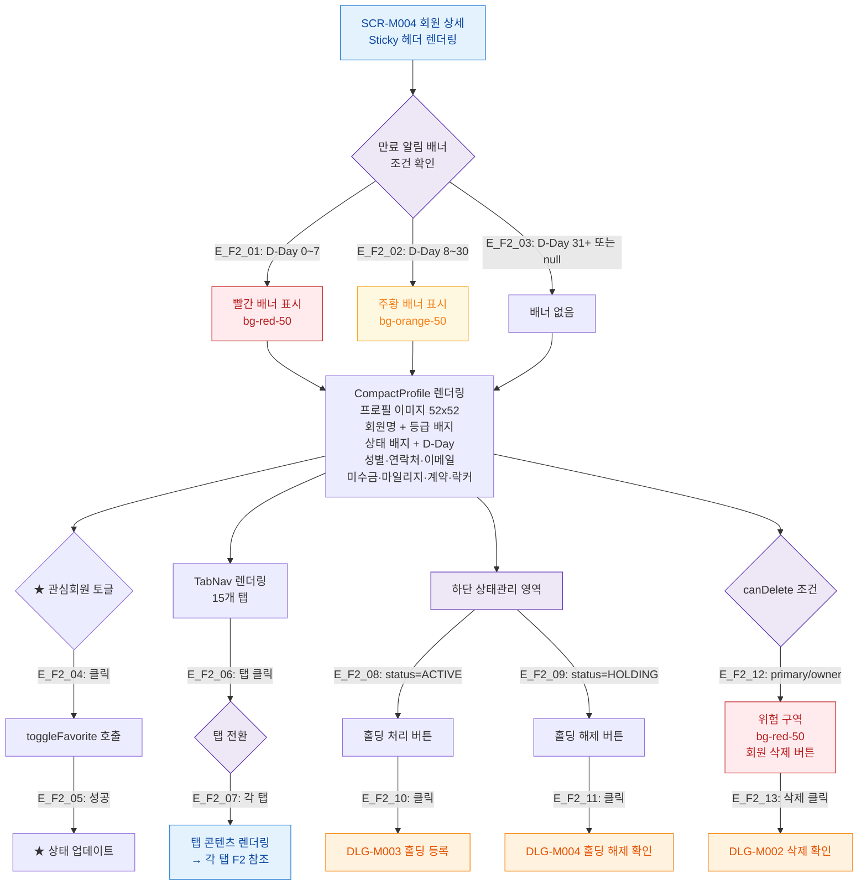

## 1. 목적

SCR-M004 프로필 헤더 영역의 Happy Path 메인 인터랙션을 정의한다. 탭 콘텐츠 인터랙션은 각 탭 다이어그램에서 별도 정의한다.

## 2. 전제조건

- SCR-M004 진입 완료 (F1 기준)
- member 데이터 정상 로드

## 3. 다이어그램

## 4. 엣지 설명

| 엣지 ID | 출발 | 도착 | 조건/액션 |
|---------|------|------|-----------|
| E_F2_01 | BANNER | BAN_RED | D-Day 0~7일 |
| E_F2_02 | BANNER | BAN_ORG | D-Day 8~30일 |
| E_F2_03 | BANNER | BAN_NONE | D-Day 31일 이상 또는 null |
| E_F2_04 | FAV | TOGGLE_FAV | ★ 아이콘 클릭 |
| E_F2_05 | TOGGLE_FAV | FAV_UPD | API 성공 |
| E_F2_06 | TAB_NAV | TAB_SWITCH | 탭 클릭 |
| E_F2_07 | TAB_SWITCH | TAB_CONTENT | 각 탭으로 전환 |
| E_F2_08 | STATUS_AREA | BTN_HOLD | status=ACTIVE |
| E_F2_09 | STATUS_AREA | BTN_UNHOLD | status=HOLDING |
| E_F2_10 | BTN_HOLD | DLG_M003 | 홀딩 처리 버튼 클릭 |
| E_F2_11 | BTN_UNHOLD | DLG_M004 | 홀딩 해제 버튼 클릭 |
| E_F2_12 | DANGER | DANGER_ZONE | canDelete=true (primary/owner) |
| E_F2_13 | DANGER_ZONE | DLG_M002 | 회원 삭제 버튼 클릭 |

## 5. TC 후보

| TC ID | 타입 | Given | When | Then |
|-------|:----:|-------|------|------|
| TC-M004-F2-01 | positive P0 | ACTIVE 회원, D-7 | 페이지 진입 | 빨간 만료 배너 표시 |
| TC-M004-F2-02 | positive P0 | ACTIVE 회원, D-20 | 페이지 진입 | 주황 만료 배너 표시 |
| TC-M004-F2-03 | positive P0 | ACTIVE 회원, D-45 | 페이지 진입 | 배너 없음 |
| TC-M004-F2-04 | positive P1 | ACTIVE 회원 | ★ 클릭 | 관심회원 토글 상태 변경 |
| TC-M004-F2-05 | positive P0 | ACTIVE 회원, manager | 홀딩 처리 버튼 클릭 | DLG-M003 열림 |
| TC-M004-F2-06 | positive P0 | HOLDING 회원 | 홀딩 해제 버튼 클릭 | DLG-M004 열림 |
| TC-M004-F2-07 | positive P1 | primary 로그인 | 회원 삭제 버튼 클릭 | DLG-M002 열림 |
