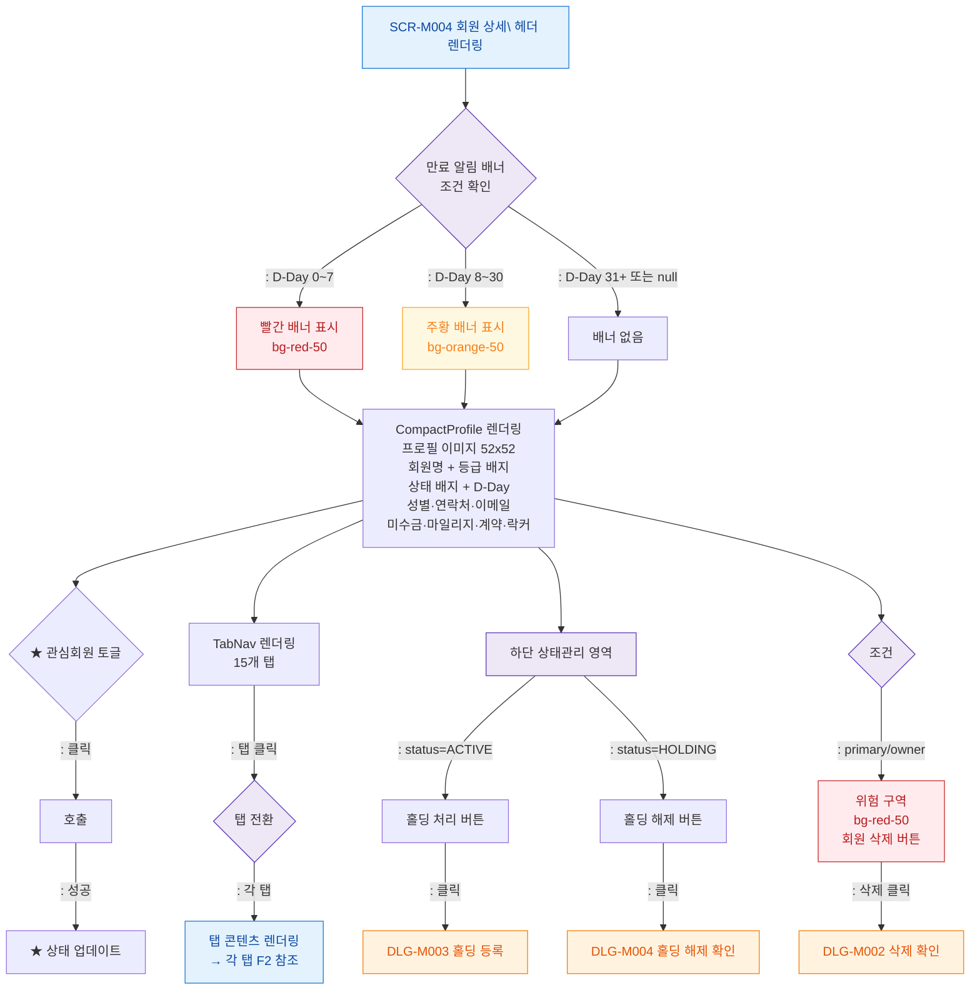

## 1. 목적

SCR-M004 프로필 헤더 영역의 Happy Path 메인 인터랙션을 정의한다. 탭 콘텐츠 인터랙션은 각 탭 다이어그램에서 별도 정의한다.

## 2. 전제조건

- SCR-M004 진입 완료 (F1 기준)
- member 데이터 정상 로드

## 3. 다이어그램

## 4. 엣지 설명

| 출발 | 도착 | 조건/액션 | |---------|------|------|-----------| | | BANNER | BAN_RED | D-Day 0~7일 | | | BANNER | BAN_ORG | D-Day 8~30일 | | | BANNER | BAN_NONE | D-Day 31일 이상 또는 null | | | FAV | TOGGLE_FAV | ★ 아이콘 클릭 | | | TOGGLE_FAV | FAV_UPD | API 성공 | | | TAB_NAV | TAB_SWITCH | 탭 클릭 | | | TAB_SWITCH | TAB_CONTENT | 각 탭으로 전환 | | | STATUS_AREA | BTN_HOLD | status=ACTIVE | | | STATUS_AREA | BTN_UNHOLD | status=HOLDING | | | BTN_HOLD | DLG_M003 | 홀딩 처리 버튼 클릭 | | | BTN_UNHOLD | DLG_M004 | 홀딩 해제 버튼 클릭 | | | DANGER | DANGER_ZONE | (primary/owner) | | | DANGER_ZONE | DLG_M002 | 회원 삭제 버튼 클릭 |
